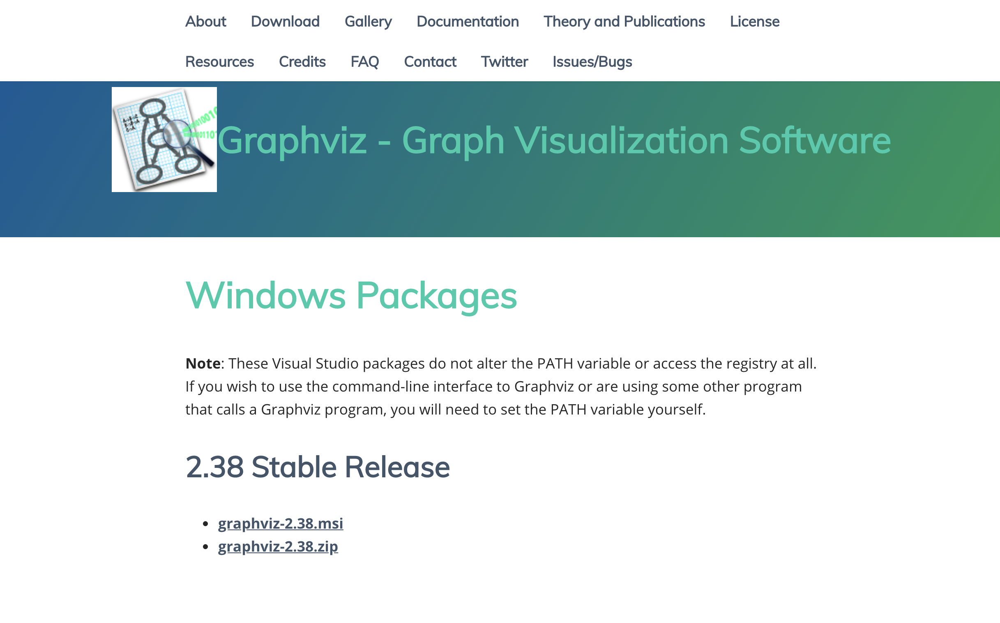
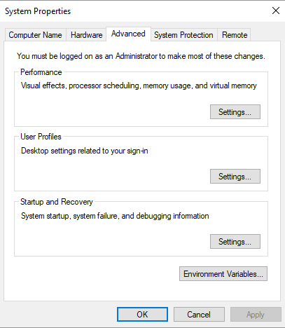
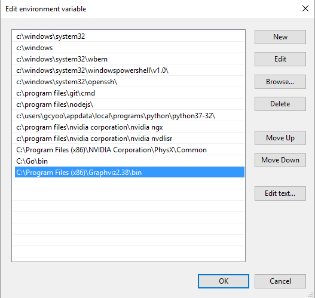

**Warning**
If students have issues with graphviz installation, please use the below information to assist them.

 Mac: 
Graphviz installation for Mac is as simple as using Homebrew to install Graphviz. 

 1. Open Terminal
2. Copy and paste the following code: 
`/usr/bin/ruby -e "$(curl -fsSL https://raw.githubusercontent.com/Homebrew/install/master/install)"`
3. Hit Return and when prompted, supply your password!
4. Finally, ensure that you have homebrew installed by simply enterring `brew -v` into the terminal. If Brew was installed correctly, you should be presented with the version of Brew installed on your machine.
5. Lastly, enter the command `brew install graphviz`, and you're done!

 Windows:
To install Graphviz for windows, head to the following URL: <https://graphviz.gitlab.io/_pages/Download/Download_windows.html>
 1. Make sure that you choose to download, `graphviz-2.38.msi`.
2. Click `Next` through all three installation prompts and wait for Graphviz to install
3. Next, head over to `System Properties`, `Advanced`, `Environment Variables`.
 
 4. Under System variables, find `Path` and click `Edit...`.
 
 5. Click `New` and by default, Graphviz should have been installed to `C:\Program Files (x86)\Graphviz2.38\bin`. So copy that file path and click `OK`.
 
 6. Finally, restart Jupyter notebook and you're all set!