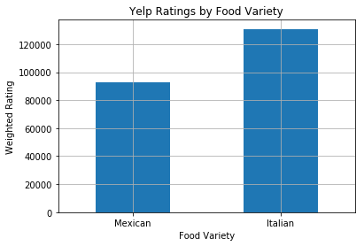
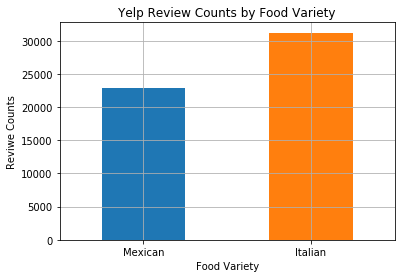

### INSTALL PYTHON 'DEPENDENCIES' FOR USE IN PROGRAM

```python
# Cell 1

# Question: What are 'Dependencies' and what is their main purpose?


# Installation 'Dependencies' for Use In the Yelp API Call Program

# Pre-written Programs & Libraries to be imported and utilized. 
import requests
import json

import numpy as np
import pandas as pd
import matplotlib.pyplot as plt
from scipy import stats
```

---

### YELP API CALL SETUP INFORMATION

```python
#Cell 2

# QuestionWhat is the purpose of the 'query parameters' in the both the Italian and Mexican url?


# Yelp API Call Basics 


# Yelp API Key - Almost all API Calls require some form of 'key' for authentication purposes.
# Helps to indentify a particular user in the event of overuse or fraud. 

ykey_access_token = "emso2XNeq2vSUaN2POAVO7J96gdU6GWEkvwI9LYukMj6a8RTjfVeWWuHeu9zX-1ibm6Oyo9OU7XWl-J7C4ql9ra1s5Ue1KjFfzzZMwvvj5laECgkvKg8mB2QGVltXHYx"


# Include Yelp Token - This 'header' will be utilized when making the API call.
# The format is defined by the specific API documentation. 

headers = {"Authorization": "Bearer " + ykey_access_token } 


# Create two endpoint URLs:
# Think of these as the request "address". 
# 'Query Parameters' also defined here. 
# In our case the search term is either 'Mexican' or 'Italian'. 
# The location is 'Chicago'
# And the number of results we want retured is capped at '50'.


url_italian = "https://api.yelp.com/v3/businesses/search?term=Italian&location=Chicago&limit=50"
url_mexican = "https://api.yelp.com/v3/businesses/search?term=Mexican&location=Chicago&limit=50"


# Print the URLs to ensure logging - 
# Print statments are very valuable in the development stage of any coding project.

print(url_italian)
print(url_mexican)
```

### Output:
```
https://api.yelp.com/v3/businesses/search?term=Italian&location=Chicago&limit=50
https://api.yelp.com/v3/businesses/search?term=Mexican&location=Chicago&limit=50
```

---

### CREATE THE ITALIAN API CALL TO YELP
```python
# Cell 3

# Question: What is the function of 'requests.get'? What is '.json()'?


#Yelp Data  - Italian

# Get the Yelp Reviews
# Here we are using the "request" dependency to call the Italian URL specified above.
# We have incorporated the 'header' for our authorization.
# We are also using the '.json' dependency so the response is returned in a format we can read. 

yelp_reviews_italian = requests.get(url_italian, headers=headers).json() 

#Print Reviews
# Here we are just printing the response so we can confirm that the YELP API call worked.

print(yelp_reviews_italian)
```

### Output
```json
{'businesses': [{'id': 'LYppbvgJlBG0SqjSKFiFGg', 'alias': 'sapori-trattoria-chicago', 'name': 'Sapori Trattoria', 'image_url': 'https://s3-media2.fl.yelpcdn.com/bphoto/CeIEaTOeC0U1e84EMVkGcA/o.jpg', 'is_closed': False, 'url': 'https://www.yelp.com/biz/sapori-trattoria-chicago?adjust_creative=x6KYg5lm4SdqqnvLdGkDRQ&utm_campaign=yelp_api_v3&utm_medium=api_v3_business_search&utm_source=x6KYg5lm4SdqqnvLdGkDRQ', 'review_count': 2011, 'categories': [{'alias': 'italian', 'title': 'Italian'}, {'alias': 'desserts', 'title': 'Desserts'}, {'alias': 'bars', 'title': 'Bars'}], 'rating': 4.5, 'coordinates': {'latitude': 41.93166, 'longitude': -87.64859}, 'transactions': ['restaurant_reservation', 'pickup'], 'price': '$$', 'location': {'address1': '2701 N Halsted St', 'address2': '', 'address3': '', 'city': 'Chicago', 'zip_code': '60614', 'country': 'US', 'state': 'IL', 'display_address': ['2701 N Halsted St', 'Chicago, IL 60614']}, 'phone': '+17738329999', 'display_phone': '(773) 832-9999', 'distance': 3810.7511360697486}, {'id': 'ziIfrqtyupmeNlPAOx6jTw', 'alias': 'quartino-ristorante-chicago', 'name': 'Quartino Ristorante', 'image_url': 'https://s3-media1.fl.yelpcdn.com/bphoto/fn1r5y5PE3v70Zr2giBuXw/o.jpg', 'is_closed': False, 'url': 'https://www.yelp.com/biz/quartino-ristorante-chicago?adjust_creative=x6KYg5lm4SdqqnvLdGkDRQ&utm_campaign=yelp_api_v3&utm_medium=api_v3_business_search&utm_source=x6KYg5lm4SdqqnvLdGkDRQ', 'review_count': 4350, 'categories': [{'alias': 'italian', 'title': 'Italian'}, {'alias': 'wine_bars', 'title': 'Wine Bars'}], 'rating': 4.0, 'coordinates': {'latitude': 41.8934479679332, 'longitude': -87.6283662020996}, 'transactions': ['delivery'], 'price': '$$', 'location': {'address1': '626 N State St', 'address2': None, 'address3': '', 'city': 'Chicago', 'zip_code': '60654', 'country': 'US', 'state': 'IL', 'display_address': ['626 N State St', 'Chicago, IL 60654']}, 'phone': '+13126985000', 'display_phone': '(312) 698-5000', 'distance': 4290.83829114424}, {'id': '7vsOVA4wrHP6f3DMQdD8og', 'alias': 'volare-ristorante-italiano-chicago', 'name': 'Volare Ristorante Italiano', 'image_url': 'https://s3-media2.fl.yelpcdn.com/bphoto/OxNqB0wkhttEpk8CUCnYLw/o.jpg', 'is_closed': False, 'url': 'https://www.yelp.com/biz/volare-ristorante-italiano-chicago?adjust_creative=x6KYg5lm4SdqqnvLdGkDRQ&utm_campaign=yelp_api_v3&utm_medium=api_v3_business_search&utm_source=x6KYg5lm4SdqqnvLdGkDRQ', 'review_count': 1811, 'categories': [{'alias': 'italian', 'title': 'Italian'}], 'rating': 4.0, 'coordinates': {'latitude': 41.8915901798304, 'longitude': -87.6225186472213}, 'transactions': ['pickup', 'restaurant_reservation', 'delivery'], 'price': '$$', 'location': {'address1': '201 E Grand Ave', 'address2': '', 'address3': '', 'city': 'Chicago', 'zip_code': '60611', 'country': 'US', 'state': 'IL', 'display_address': ['201 E Grand Ave', 'Chicago, IL 60611']}, 'phone': '+13124109900', 'display_phone': '(312) 410-9900', 'distance': 4814.997711304708}, {'id': 'vb5hLPqsBEPmBsY-77Wl2g', 'alias': 'viaggio-ristorante-and-lounge-chicago', 'name': 'Viaggio Ristorante & Lounge', 'image_url': 'https://s3-media2.fl.yelpcdn.com/bphoto/Y5Rur7PudfQcrcvvECIJKA/o.jpg', 'is_closed': False, 'url': 'https://www.yelp.com/biz/viaggio-ristorante-and-lounge-chicago?adjust_creative=x6KYg5lm4SdqqnvLdGkDRQ&utm_campaign=yelp_api_v3&utm_medium=api_v3_business_search&utm_source=x6KYg5lm4SdqqnvLdGkDRQ', 'review_count': 661, 'categories': [{'alias': 'italian', 'title': 'Italian'}], 'rating': 4.5, 'coordinates': {'latitude': 41.88179, 'longitude': -87.6609}, 'transactions': ['delivery', 'pickup'], 'price': '$$', 'location': {'address1': '1330 W Madison St', 'address2': '', 'address3': '', 'city': 'Chicago', 'zip_code': '60607', 'country': 'US', 'state': 'IL', 'display_address': ['1330 W Madison St', 'Chicago, IL 60607']}, 'phone': '+13128293333', 'display_phone': '(312) 829-3333', 'distance': 2950.937603010114}, {'id': 'jlVvQOf4YE3ZO1gMFSAdww', 'alias': 'buona-terra-chicago-2', 'name': 'Buona Terra', 'image_url': 'https://s3-media4.fl.yelpcdn.com/bphoto/YUFC3sYpK3Y84eoF72Lqsg/o.jpg', 'is_closed': False, 'url': 'https://www.yelp.com/biz/buona-terra-chicago-2?adjust_creative=x6KYg5lm4SdqqnvLdGkDRQ&utm_campaign=yelp_api_v3&utm_medium=api_v3_business_search&utm_source=x6KYg5lm4SdqqnvLdGkDRQ', 'review_count': 601, 'categories': [{'alias': 'italian', 'title': 'Italian'}, {'alias': 'wine_bars', 'title': 'Wine Bars'}], 'rating': 4.5, 'coordinates': {'latitude': 41.92788, 'longitude': -87.69722}, 'transactions': ['pickup', 'delivery'], 'price': '$$', 'location': {'address1': '2535 N California Ave', 'address2': None, 'address3': '', 'city': 'Chicago', 'zip_code': '60647', 'country': 'US', 'state': 'IL', 'display_address': ['2535 N California Ave', 'Chicago, IL 60647']}, 'phone': '+17732893800', 'display_phone': '(773) 289-3800', 'distance': 2986.4313625194523}, {'id': '1Q7RL7Hc63wKa2A9ec3zXw', 'alias': 'il-porcellino-chicago', 'name': 'il Porcellino', 'image_url': 'https://s3-media1.fl.yelpcdn.com/bphoto/vEHFloVpSKFFtjy6nsa_AA/o.jpg', 'is_closed': False, 'url': 'https://www.yelp.com/biz/il-porcellino-chicago?adjust_creative=x6KYg5lm4SdqqnvLdGkDRQ&utm_campaign=yelp_api_v3&utm_medium=api_v3_business_search&utm_source=x6KYg5lm4SdqqnvLdGkDRQ', 'review_count': 482, 'categories': [{'alias': 'italian', 'title': 'Italian'}, {'alias': 'bars', 'title': 'Bars'}], 'rating': 4.5, 'coordinates': {'latitude': 41.88979, 'longitude': -87.6303}, 'transactions': ['pickup', 'delivery'], 'price': '$$', 'location': {'address1': '59 W Hubbard', 'address2': '', 'address3': '', 'city': 'Chicago', 'zip_code': '60654', 'country': 'US', 'state': 'IL', 'display_address': ['59 W Hubbard', 'Chicago, IL 60654']}, 'phone': '+13125950800', 'display_phone': '(312) 595-0800', 'distance': 4285.999210611955}, {'id': 'bQaiow1WcwwSODUo9hHOMQ', 'alias': 'rpm-italian-chicago', 'name': 'RPM Italian', 'image_url': 'https://s3-media1.fl.yelpcdn.com/bphoto/JCnkppv1k6JT-ot-vhIJQw/o.jpg', 'is_closed': False, 'url': 'https://www.yelp.com/biz/rpm-italian-chicago?adjust_creative=x6KYg5lm4SdqqnvLdGkDRQ&utm_campaign=yelp_api_v3&utm_medium=api_v3_business_search&utm_source=x6KYg5lm4SdqqnvLdGkDRQ', 'review_count': 2820, 'categories': [{'alias': 'italian', 'title': 'Italian'}], 'rating': 4.0, 'coordinates': {'latitude': 41.8909608540557, 'longitude': -87.6300418625656}, 'transactions': ['delivery', 'pickup'], 'price': '$$$', 'location': {'address1': '52 W Illinois St', 'address2': '', 'address3': '', 'city': 'Chicago', 'zip_code': '60654', 'country': 'US', 'state': 'IL', 'display_address': ['52 W Illinois St', 'Chicago, IL 60654']}, 'phone': '+13122221888', 'display_phone': '(312) 222-1888', 'distance': 4253.689761756825}, {'id': 'o0DaPvRb4IWH7hUWVCnoGw', 'alias': 'monteverde-chicago', 'name': 'Monteverde', 'image_url': 'https://s3-media2.fl.yelpcdn.com/bphoto/w1M2xmwWh1hQrRfZAGXQhQ/o.jpg', 'is_closed': False, 'url': 'https://www.yelp.com/biz/monteverde-chicago?adjust_creative=x6KYg5lm4SdqqnvLdGkDRQ&utm_campaign=yelp_api_v3&utm_medium=api_v3_business_search&utm_source=x6KYg5lm4SdqqnvLdGkDRQ', 'review_count': 673, 'categories': [{'alias': 'italian', 'title': 'Italian'}, {'alias': 'desserts', 'title': 'Desserts'}, {'alias': 'wine_bars', 'title': 'Wine Bars'}], 'rating': 4.5, 'coordinates': {'latitude': 41.88191, 'longitude': -87.65302}, 'transactions': [], 'price': '$$$', 'location': {'address1': '1020 W Madison St', 'address2': '', 'address3': '', 'city': 'Chicago', 'zip_code': '60607', 'country': 'US', 'state': 'IL', 'display_address': ['1020 W Madison St', 'Chicago, IL 60607']}, 'phone': '+13128883041', 'display_phone': '(312) 888-3041', 'distance': 3300.675321663359}, {'id': '1hZJWzpYgUpOMkmGZAewsg', 'alias': 'topo-gigio-ristorante-chicago', 'name': 'Topo Gigio Ristorante', 'image_url': 'https://s3-media2.fl.yelpcdn.com/bphoto/evQy54EoAFVUwzn2jXiD5A/o.jpg', 'is_closed': False, 'url': 'https://www.yelp.com/biz/topo-gigio-ristorante-chicago?adjust_creative=x6KYg5lm4SdqqnvLdGkDRQ&utm_campaign=yelp_api_v3&utm_medium=api_v3_business_search&utm_source=x6KYg5lm4SdqqnvLdGkDRQ', 'review_count': 827, 'categories': [{'alias': 'italian', 'title': 'Italian'}], 'rating': 4.0, 'coordinates': {'latitude': 41.9096594975818, 'longitude': -87.6348415912861}, 'transactions': ['pickup'], 'price': '$$', 'location': {'address1': '1516 N Wells St', 'address2': '', 'address3': '', 'city': 'Chicago', 'zip_code': '60610', 'country': 'US', 'state': 'IL', 'display_address': ['1516 N Wells St', 'Chicago, IL 60610']}, 'phone': '+13122669355', 'display_phone': '(312) 266-9355', 'distance': 3587.1480005180565}, {'id': 'KXiClWndL6UyPJDt7y50zQ', 'alias': 'la-scarola-chicago', 'name': 'La Scarola', 'image_url': 'https://s3-media3.fl.yelpcdn.com/bphoto/3a1JkWZURbDaYISZ8u-KgQ/o.jpg', 'is_closed': False, 'url': 'https://www.yelp.com/biz/la-scarola-chicago?adjust_creative=x6KYg5lm4SdqqnvLdGkDRQ&utm_campaign=yelp_api_v3&utm_medium=api_v3_business_search&utm_source=x6KYg5lm4SdqqnvLdGkDRQ', 'review_count': 1081, 'categories': [{'alias': 'italian', 'title': 'Italian'}, {'alias': 'bars', 'title': 'Bars'}], 'rating': 4.0, 'coordinates': {'latitude': 41.8910731156813, 'longitude': -87.6468847784913}, 'transactions': ['delivery', 'pickup'], 'price': '$$', 'location': {'address1': '721 W Grand Ave', 'address2': '', 'address3': '', 'city': 'Chicago', 'zip_code': '60610', 'country': 'US', 'state': 'IL', 'display_address': ['721 W Grand Ave', 'Chicago, IL 60610']}, 'phone': '+13122431740', 'display_phone': '(312) 243-1740', 'distance': 2997.5906595323}, {'id': '7Ig90WlrxTm-oLGt8AQrfQ', 'alias': 'enoteca-roma-ristorante-chicago', 'name': 'Enoteca Roma Ristorante', 'image_url': 'https://s3-media3.fl.yelpcdn.com/bphoto/N_kLyNJUhKMd-0PlMv_-GA/o.jpg', 'is_closed': False, 'url': 'https://www.yelp.com/biz/enoteca-roma-ristorante-chicago?adjust_creative=x6KYg5lm4SdqqnvLdGkDRQ&utm_campaign=yelp_api_v3&utm_medium=api_v3_business_search&utm_source=x6KYg5lm4SdqqnvLdGkDRQ', 'review_count': 469, 'categories': [{'alias': 'wine_bars', 'title': 'Wine Bars'}, {'alias': 'italian', 'title': 'Italian'}], 'rating': 4.0, 'coordinates': {'latitude': 41.903222, 'longitude': -87.6816573}, 'transactions': ['pickup', 'delivery'], 'price': '$$', 'location': {'address1': '2146 W Division St', 'address2': '', 'address3': '', 'city': 'Chicago', 'zip_code': '60622', 'country': 'US', 'state': 'IL', 'display_address': ['2146 W Division St', 'Chicago, IL 60622']}, 'phone': '+17737727700', 'display_phone': '(773) 772-7700', 'distance': 377.956847746203}, {'id': 'tzP7xNT7OokI6JKgtINTlA', 'alias': 'antico-chicago', 'name': 'Antico', 'image_url': 'https://s3-media2.fl.yelpcdn.com/bphoto/ySLiZ9ODZb-oPTBY8tRxvg/o.jpg', 'is_closed': False, 'url': 'https://www.yelp.com/biz/antico-chicago?adjust_creative=x6KYg5lm4SdqqnvLdGkDRQ&utm_campaign=yelp_api_v3&utm_medium=api_v3_business_search&utm_source=x6KYg5lm4SdqqnvLdGkDRQ', 'review_count': 208, 'categories': [{'alias': 'italian', 'title': 'Italian'}], 'rating': 4.5, 'coordinates': {'latitude': 41.91746, 'longitude': -87.68281}, 'transactions': [], 'price': '$$$', 'location': {'address1': '1946 N Leavitt St', 'address2': '', 'address3': '', 'city': 'Chicago', 'zip_code': '60647', 'country': 'US', 'state': 'IL', 'display_address': ['1946 N Leavitt St', 'Chicago, IL 60647']}, 'phone': '+17734894895', 'display_phone': '(773) 489-4895', 'distance': 1428.8383921077507}, {'id': 'T1byj0cyKsnzgPFDPh3NXA', 'alias': 'osteria-langhe-chicago', 'name': 'Osteria Langhe', 'image_url': 'https://s3-media3.fl.yelpcdn.com/bphoto/okxWL4FdiSsw5xW2xDEj4Q/o.jpg', 'is_closed': False, 'url': 'https://www.yelp.com/biz/osteria-langhe-chicago?adjust_creative=x6KYg5lm4SdqqnvLdGkDRQ&utm_campaign=yelp_api_v3&utm_medium=api_v3_business_search&utm_source=x6KYg5lm4SdqqnvLdGkDRQ', 'review_count': 331, 'categories': [{'alias': 'italian', 'title': 'Italian'}], 'rating': 4.0, 'coordinates': {'latitude': 41.91763, 'longitude': -87.6983279}, 'transactions': [], 'price': '$$$', 'location': {'address1': '2824 W Armitage Ave', 'address2': '', 'address3': '', 'city': 'Chicago', 'zip_code': '60647', 'country': 'US', 'state': 'IL', 'display_address': ['2824 W Armitage Ave', 'Chicago, IL 60647']}, 'phone': '+17736611582', 'display_phone': '(773) 661-1582', 'distance': 2195.041632620882}, {'id': 'kdobEvkH_YHleJvLLxzb6A', 'alias': 'a-tavola-chicago', 'name': 'A Tavola', 'image_url': 'https://s3-media4.fl.yelpcdn.com/bphoto/vx7M8KWAgR3-7TedNsEHBw/o.jpg', 'is_closed': False, 'url': 'https://www.yelp.com/biz/a-tavola-chicago?adjust_creative=x6KYg5lm4SdqqnvLdGkDRQ&utm_campaign=yelp_api_v3&utm_medium=api_v3_business_search&utm_source=x6KYg5lm4SdqqnvLdGkDRQ', 'review_count': 352, 'categories': [{'alias': 'italian', 'title': 'Italian'}], 'rating': 4.0, 'coordinates': {'latitude': 41.8960999, 'longitude': -87.68141}, 'transactions': ['pickup'], 'price': '$$$', 'location': {'address1': '2148 W Chicago Ave', 'address2': '', 'address3': '', 'city': 'Chicago', 'zip_code': '60622', 'country': 'US', 'state': 'IL', 'display_address': ['2148 W Chicago Ave', 'Chicago, IL 60622']}, 'phone': '+17732767567', 'display_phone': '(773) 276-7567', 'distance': 1064.7099923975286}, {'id': 'IvdOI86_CSCRFpid2atnyA', 'alias': 'davanti-enoteca-chicago', 'name': 'Davanti Enoteca', 'image_url': 'https://s3-media3.fl.yelpcdn.com/bphoto/hYeLgsfSeaaNVKrLcc7V_g/o.jpg', 'is_closed': False, 'url': 'https://www.yelp.com/biz/davanti-enoteca-chicago?adjust_creative=x6KYg5lm4SdqqnvLdGkDRQ&utm_campaign=yelp_api_v3&utm_medium=api_v3_business_search&utm_source=x6KYg5lm4SdqqnvLdGkDRQ', 'review_count': 1168, 'categories': [{'alias': 'italian', 'title': 'Italian'}], 'rating': 4.0, 'coordinates': {'latitude': 41.86911, 'longitude': -87.66147}, 'transactions': ['pickup'], 'price': '$$', 'location': {'address1': '1359 W Taylor St', 'address2': '', 'address3': '', 'city': 'Chicago', 'zip_code': '60607', 'country': 'US', 'state': 'IL', 'display_address': ['1359 W Taylor St', 'Chicago, IL 60607']}, 'phone': '+13122265550', 'display_phone': '(312) 226-5550', 'distance': 4229.8598919670685}, {'id': '6PQTqW9j-sriDBQyQCJbjw', 'alias': 'mia-francesca-chicago', 'name': 'Mia Francesca', 'image_url': 'https://s3-media1.fl.yelpcdn.com/bphoto/rHNMxY3fX8OmVX9TzSTsOw/o.jpg', 'is_closed': False, 'url': 'https://www.yelp.com/biz/mia-francesca-chicago?adjust_creative=x6KYg5lm4SdqqnvLdGkDRQ&utm_campaign=yelp_api_v3&utm_medium=api_v3_business_search&utm_source=x6KYg5lm4SdqqnvLdGkDRQ', 'review_count': 639, 'categories': [{'alias': 'italian', 'title': 'Italian'}], 'rating': 4.0, 'coordinates': {'latitude': 41.9420064, 'longitude': -87.6523323}, 'transactions': ['delivery', 'pickup'], 'price': '$$', 'location': {'address1': '3311 N Clark St', 'address2': None, 'address3': '', 'city': 'Chicago', 'zip_code': '60657', 'country': 'US', 'state': 'IL', 'display_address': ['3311 N Clark St', 'Chicago, IL 60657']}, 'phone': '+17732813310', 'display_phone': '(773) 281-3310', 'distance': 4605.913122964296}, {'id': 'ncx9jZpjFZxKSZHB94rFkg', 'alias': 'nando-milano-trattoria-chicago', 'name': 'Nando Milano Trattoria', 'image_url': 'https://s3-media4.fl.yelpcdn.com/bphoto/dnde6bLJj0MBc7KCGsEKjg/o.jpg', 'is_closed': False, 'url': 'https://www.yelp.com/biz/nando-milano-trattoria-chicago?adjust_creative=x6KYg5lm4SdqqnvLdGkDRQ&utm_campaign=yelp_api_v3&utm_medium=api_v3_business_search&utm_source=x6KYg5lm4SdqqnvLdGkDRQ', 'review_count': 389, 'categories': [{'alias': 'italian', 'title': 'Italian'}], 'rating': 4.0, 'coordinates': {'latitude': 41.90344, 'longitude': -87.68041}, 'transactions': ['pickup', 'delivery'], 'price': '$$', 'location': {'address1': '2114 W Division St', 'address2': '', 'address3': '', 'city': 'Chicago', 'zip_code': '60622', 'country': 'US', 'state': 'IL', 'display_address': ['2114 W Division St', 'Chicago, IL 60622']}, 'phone': '+17734862636', 'display_phone': '(773) 486-2636', 'distance': 295.5640777302986}, {'id': 'wfxgPtSkiAfkKNBVEWts9g', 'alias': 'bar-roma-chicago', 'name': 'Bar Roma', 'image_url': 'https://s3-media4.fl.yelpcdn.com/bphoto/qb3xIO6nBqFpPFpjqIoMgw/o.jpg', 'is_closed': False, 'url': 'https://www.yelp.com/biz/bar-roma-chicago?adjust_creative=x6KYg5lm4SdqqnvLdGkDRQ&utm_campaign=yelp_api_v3&utm_medium=api_v3_business_search&utm_source=x6KYg5lm4SdqqnvLdGkDRQ', 'review_count': 235, 'categories': [{'alias': 'cocktailbars', 'title': 'Cocktail Bars'}, {'alias': 'italian', 'title': 'Italian'}], 'rating': 4.5, 'coordinates': {'latitude': 41.9745114390209, 'longitude': -87.668036185205}, 'transactions': ['pickup', 'delivery'], 'price': '$$', 'location': {'address1': '5101 N Clark St', 'address2': '', 'address3': None, 'city': 'Chicago', 'zip_code': '60640', 'country': 'US', 'state': 'IL', 'display_address': ['5101 N Clark St', 'Chicago, IL 60640']}, 'phone': '+17739427572', 'display_phone': '(773) 942-7572', 'distance': 7753.471502492338}, {'id': 'IX34m-olKrlEeeEIXEPh9g', 'alias': 'francos-ristorante-chicago', 'name': "Franco's Ristorante", 'image_url': 'https://s3-media3.fl.yelpcdn.com/bphoto/s1igyiIXtwi8Uhu3sfSEcg/o.jpg', 'is_closed': False, 'url': 'https://www.yelp.com/biz/francos-ristorante-chicago?adjust_creative=x6KYg5lm4SdqqnvLdGkDRQ&utm_campaign=yelp_api_v3&utm_medium=api_v3_business_search&utm_source=x6KYg5lm4SdqqnvLdGkDRQ', 'review_count': 170, 'categories': [{'alias': 'italian', 'title': 'Italian'}], 'rating': 4.5, 'coordinates': {'latitude': 41.83843, 'longitude': -87.6343}, 'transactions': ['pickup', 'delivery'], 'price': '$$', 'location': {'address1': '300 W 31st St', 'address2': '', 'address3': '', 'city': 'Chicago', 'zip_code': '60616', 'country': 'US', 'state': 'IL', 'display_address': ['300 W 31st St', 'Chicago, IL 60616']}, 'phone': '+13122259566', 'display_phone': '(312) 225-9566', 'distance': 8254.479537905396}, {'id': 'JMa9cTNQA5mm4GbR2W8Oiw', 'alias': 'piccolo-sogno-chicago', 'name': 'Piccolo Sogno', 'image_url': 'https://s3-media2.fl.yelpcdn.com/bphoto/DU7nWCfcp8gQfN6pMZaezg/o.jpg', 'is_closed': False, 'url': 'https://www.yelp.com/biz/piccolo-sogno-chicago?adjust_creative=x6KYg5lm4SdqqnvLdGkDRQ&utm_campaign=yelp_api_v3&utm_medium=api_v3_business_search&utm_source=x6KYg5lm4SdqqnvLdGkDRQ', 'review_count': 1108, 'categories': [{'alias': 'italian', 'title': 'Italian'}], 'rating': 4.0, 'coordinates': {'latitude': 41.8908673494353, 'longitude': -87.6477823122675}, 'transactions': [], 'price': '$$$', 'location': {'address1': '464 N Halsted St', 'address2': '', 'address3': '', 'city': 'Chicago', 'zip_code': '60642', 'country': 'US', 'state': 'IL', 'display_address': ['464 N Halsted St', 'Chicago, IL 60642']}, 'phone': '+13124210077', 'display_phone': '(312) 421-0077', 'distance': 2946.7890492540896}, {'id': 'hVf31CYionZPWquqKnOsUw', 'alias': 'disotto-enoteca-chicago', 'name': 'DiSotto Enoteca', 'image_url': 'https://s3-media1.fl.yelpcdn.com/bphoto/Nky660ByG7FisKlpCbAHEA/o.jpg', 'is_closed': False, 'url': 'https://www.yelp.com/biz/disotto-enoteca-chicago?adjust_creative=x6KYg5lm4SdqqnvLdGkDRQ&utm_campaign=yelp_api_v3&utm_medium=api_v3_business_search&utm_source=x6KYg5lm4SdqqnvLdGkDRQ', 'review_count': 228, 'categories': [{'alias': 'italian', 'title': 'Italian'}], 'rating': 4.5, 'coordinates': {'latitude': 41.89871, 'longitude': -87.62142}, 'transactions': [], 'price': '$$', 'location': {'address1': '200 E Chestnut St', 'address2': '', 'address3': '', 'city': 'Chicago', 'zip_code': '60611', 'country': 'US', 'state': 'IL', 'display_address': ['200 E Chestnut St', 'Chicago, IL 60611']}, 'phone': '+13124828727', 'display_phone': '(312) 482-8727', 'distance': 4723.047156191371}, {'id': 'NGfbRjWoqUh2fGw8DU_pmA', 'alias': 'caro-mio-chicago', 'name': 'Caro Mio', 'image_url': 'https://s3-media3.fl.yelpcdn.com/bphoto/jczZXxO7a9u0N04CLALEYQ/o.jpg', 'is_closed': False, 'url': 'https://www.yelp.com/biz/caro-mio-chicago?adjust_creative=x6KYg5lm4SdqqnvLdGkDRQ&utm_campaign=yelp_api_v3&utm_medium=api_v3_business_search&utm_source=x6KYg5lm4SdqqnvLdGkDRQ', 'review_count': 578, 'categories': [{'alias': 'italian', 'title': 'Italian'}], 'rating': 4.0, 'coordinates': {'latitude': 41.9651506, 'longitude': -87.6758369}, 'transactions': ['pickup', 'delivery'], 'price': '$$', 'location': {'address1': '1833 W Wilson Ave', 'address2': '', 'address3': '', 'city': 'Chicago', 'zip_code': '60640', 'country': 'US', 'state': 'IL', 'display_address': ['1833 W Wilson Ave', 'Chicago, IL 60640']}, 'phone': '+17732755000', 'display_phone': '(773) 275-5000', 'distance': 6672.631775626292}, {'id': '3NViikBJwbjvq1ensGYRcw', 'alias': 'pasta-d-arte-trattoria-italiana-chicago-2', 'name': "Pasta D'Arte Trattoria Italiana", 'image_url': 'https://s3-media2.fl.yelpcdn.com/bphoto/BO4h5apZWU2iaXHGafR77w/o.jpg', 'is_closed': False, 'url': 'https://www.yelp.com/biz/pasta-d-arte-trattoria-italiana-chicago-2?adjust_creative=x6KYg5lm4SdqqnvLdGkDRQ&utm_campaign=yelp_api_v3&utm_medium=api_v3_business_search&utm_source=x6KYg5lm4SdqqnvLdGkDRQ', 'review_count': 310, 'categories': [{'alias': 'italian', 'title': 'Italian'}], 'rating': 4.5, 'coordinates': {'latitude': 41.99563, 'longitude': -87.78578}, 'transactions': ['pickup', 'delivery'], 'price': '$$', 'location': {'address1': '6311 N Milwaukee Ave', 'address2': '', 'address3': '', 'city': 'Chicago', 'zip_code': '60646', 'country': 'US', 'state': 'IL', 'display_address': ['6311 N Milwaukee Ave', 'Chicago, IL 60646']}, 'phone': '+17737631181', 'display_phone': '(773) 763-1181', 'distance': 13453.500194909257}, {'id': 'aSxxfNO_647MtX8zc6vhOg', 'alias': 'angelina-ristorante-chicago', 'name': 'Angelina Ristorante', 'image_url': 'https://s3-media1.fl.yelpcdn.com/bphoto/iiNJezD3p8OOH0-sUfCSDw/o.jpg', 'is_closed': False, 'url': 'https://www.yelp.com/biz/angelina-ristorante-chicago?adjust_creative=x6KYg5lm4SdqqnvLdGkDRQ&utm_campaign=yelp_api_v3&utm_medium=api_v3_business_search&utm_source=x6KYg5lm4SdqqnvLdGkDRQ', 'review_count': 704, 'categories': [{'alias': 'italian', 'title': 'Italian'}], 'rating': 4.0, 'coordinates': {'latitude': 41.947146362475, 'longitude': -87.6469336269836}, 'transactions': [], 'price': '$$', 'location': {'address1': '3561 N Broadway St', 'address2': '', 'address3': '', 'city': 'Chicago', 'zip_code': '60657', 'country': 'US', 'state': 'IL', 'display_address': ['3561 N Broadway St', 'Chicago, IL 60657']}, 'phone': '+17739355933', 'display_phone': '(773) 935-5933', 'distance': 5320.063524901548}, {'id': '0fFLUKl71vv3eNV2xhikEw', 'alias': 'spacca-napoli-chicago', 'name': 'Spacca Napoli', 'image_url': 'https://s3-media2.fl.yelpcdn.com/bphoto/wNzXwZlrUFTs_BlsShbOnA/o.jpg', 'is_closed': False, 'url': 'https://www.yelp.com/biz/spacca-napoli-chicago?adjust_creative=x6KYg5lm4SdqqnvLdGkDRQ&utm_campaign=yelp_api_v3&utm_medium=api_v3_business_search&utm_source=x6KYg5lm4SdqqnvLdGkDRQ', 'review_count': 1387, 'categories': [{'alias': 'pizza', 'title': 'Pizza'}, {'alias': 'italian', 'title': 'Italian'}], 'rating': 4.0, 'coordinates': {'latitude': 41.963286, 'longitude': -87.673801}, 'transactions': [], 'price': '$$', 'location': {'address1': '1769 W Sunnyside Ave', 'address2': None, 'address3': '', 'city': 'Chicago', 'zip_code': '60640', 'country': 'US', 'state': 'IL', 'display_address': ['1769 W Sunnyside Ave', 'Chicago, IL 60640']}, 'phone': '+17738782420', 'display_phone': '(773) 878-2420', 'distance': 6471.703485933878}, {'id': 'eTjl8rHLGWWhc65cFjcDLA', 'alias': 'trattoria-no-10-chicago', 'name': 'Trattoria No. 10', 'image_url': 'https://s3-media2.fl.yelpcdn.com/bphoto/vqVLIgOxfHkD5rNE54U4Fg/o.jpg', 'is_closed': False, 'url': 'https://www.yelp.com/biz/trattoria-no-10-chicago?adjust_creative=x6KYg5lm4SdqqnvLdGkDRQ&utm_campaign=yelp_api_v3&utm_medium=api_v3_business_search&utm_source=x6KYg5lm4SdqqnvLdGkDRQ', 'review_count': 564, 'categories': [{'alias': 'italian', 'title': 'Italian'}], 'rating': 4.0, 'coordinates': {'latitude': 41.8824272155762, 'longitude': -87.6296997070312}, 'transactions': ['pickup', 'delivery'], 'price': '$$$', 'location': {'address1': '10 N Dearborn St', 'address2': '', 'address3': '', 'city': 'Chicago', 'zip_code': '60602', 'country': 'US', 'state': 'IL', 'display_address': ['10 N Dearborn St', 'Chicago, IL 60602']}, 'phone': '+13129841718', 'display_phone': '(312) 984-1718', 'distance': 4712.477008946713}, {'id': 'oLM9piDKbj2PDgy-m3XEcQ', 'alias': 'calo-ristorante-chicago', 'name': 'Calo Ristorante', 'image_url': 'https://s3-media3.fl.yelpcdn.com/bphoto/1ks5J230bxECNXgnNr4xcA/o.jpg', 'is_closed': False, 'url': 'https://www.yelp.com/biz/calo-ristorante-chicago?adjust_creative=x6KYg5lm4SdqqnvLdGkDRQ&utm_campaign=yelp_api_v3&utm_medium=api_v3_business_search&utm_source=x6KYg5lm4SdqqnvLdGkDRQ', 'review_count': 942, 'categories': [{'alias': 'pizza', 'title': 'Pizza'}, {'alias': 'italian', 'title': 'Italian'}], 'rating': 4.0, 'coordinates': {'latitude': 41.97934, 'longitude': -87.66793}, 'transactions': ['pickup', 'delivery'], 'price': '$$', 'location': {'address1': '5343 N Clark St', 'address2': '', 'address3': '', 'city': 'Chicago', 'zip_code': '60640', 'country': 'US', 'state': 'IL', 'display_address': ['5343 N Clark St', 'Chicago, IL 60640']}, 'phone': '+17732717725', 'display_phone': '(773) 271-7725', 'distance': 8289.843836737922}, {'id': 'Dcd84k1YyljpxdF7x1fW5w', 'alias': 'pisolino-chicago', 'name': 'Pisolino', 'image_url': 'https://s3-media3.fl.yelpcdn.com/bphoto/afeI153epJ7b0qB0R3rdjw/o.jpg', 'is_closed': False, 'url': 'https://www.yelp.com/biz/pisolino-chicago?adjust_creative=x6KYg5lm4SdqqnvLdGkDRQ&utm_campaign=yelp_api_v3&utm_medium=api_v3_business_search&utm_source=x6KYg5lm4SdqqnvLdGkDRQ', 'review_count': 106, 'categories': [{'alias': 'pizza', 'title': 'Pizza'}, {'alias': 'italian', 'title': 'Italian'}], 'rating': 4.5, 'coordinates': {'latitude': 41.9392551, 'longitude': -87.6970157}, 'transactions': ['pickup', 'delivery'], 'price': '$$', 'location': {'address1': '2755 W Belmont Ave', 'address2': '', 'address3': None, 'city': 'Chicago', 'zip_code': '60618', 'country': 'US', 'state': 'IL', 'display_address': ['2755 W Belmont Ave', 'Chicago, IL 60618']}, 'phone': '+17732936025', 'display_phone': '(773) 293-6025', 'distance': 4124.422738333529}, {'id': '22714mxj2e61k4xfjfqYHw', 'alias': 'sofi-restaurant-chicago', 'name': 'Sofi Restaurant', 'image_url': 'https://s3-media2.fl.yelpcdn.com/bphoto/Z_Yc7W9jEL0Vt6UD9R4PzQ/o.jpg', 'is_closed': False, 'url': 'https://www.yelp.com/biz/sofi-restaurant-chicago?adjust_creative=x6KYg5lm4SdqqnvLdGkDRQ&utm_campaign=yelp_api_v3&utm_medium=api_v3_business_search&utm_source=x6KYg5lm4SdqqnvLdGkDRQ', 'review_count': 327, 'categories': [{'alias': 'italian', 'title': 'Italian'}], 'rating': 4.0, 'coordinates': {'latitude': 41.8738179, 'longitude': -87.6292004}, 'transactions': ['pickup'], 'price': '$$', 'location': {'address1': '616 S Dearborn St', 'address2': '', 'address3': '', 'city': 'Chicago', 'zip_code': '60605', 'country': 'US', 'state': 'IL', 'display_address': ['616 S Dearborn St', 'Chicago, IL 60605']}, 'phone': '+13127535504', 'display_phone': '(312) 753-5504', 'distance': 5320.324913483423}, {'id': 'fGNGjLrTKb75W94DXiWCxw', 'alias': 'ignotz-ristorante-chicago', 'name': 'Ignotz Ristorante', 'image_url': 'https://s3-media3.fl.yelpcdn.com/bphoto/osv1e2v-M9iJf10SfxUmbw/o.jpg', 'is_closed': False, 'url': 'https://www.yelp.com/biz/ignotz-ristorante-chicago?adjust_creative=x6KYg5lm4SdqqnvLdGkDRQ&utm_campaign=yelp_api_v3&utm_medium=api_v3_business_search&utm_source=x6KYg5lm4SdqqnvLdGkDRQ', 'review_count': 271, 'categories': [{'alias': 'italian', 'title': 'Italian'}], 'rating': 4.5, 'coordinates': {'latitude': 41.8478012084961, 'longitude': -87.6827697753906}, 'transactions': ['pickup', 'delivery'], 'price': '$$', 'location': {'address1': '2421 S Oakley Ave', 'address2': '', 'address3': '', 'city': 'Chicago', 'zip_code': '60608', 'country': 'US', 'state': 'IL', 'display_address': ['2421 S Oakley Ave', 'Chicago, IL 60608']}, 'phone': '+17735790300', 'display_phone': '(773) 579-0300', 'distance': 6392.041028591422}, {'id': 'Xc7KC3XLxYUhM9Xzh-eDvA', 'alias': 'sals-trattoria-chicago-2', 'name': "Sal's Trattoria", 'image_url': 'https://s3-media2.fl.yelpcdn.com/bphoto/zVys8hIsep9FPGmbfcfx0g/o.jpg', 'is_closed': False, 'url': 'https://www.yelp.com/biz/sals-trattoria-chicago-2?adjust_creative=x6KYg5lm4SdqqnvLdGkDRQ&utm_campaign=yelp_api_v3&utm_medium=api_v3_business_search&utm_source=x6KYg5lm4SdqqnvLdGkDRQ', 'review_count': 124, 'categories': [{'alias': 'italian', 'title': 'Italian'}], 'rating': 4.5, 'coordinates': {'latitude': 41.9335, 'longitude': -87.6639299}, 'transactions': ['pickup', 'restaurant_reservation', 'delivery'], 'price': '$$', 'location': {'address1': '2834 N Southport Ave', 'address2': None, 'address3': '', 'city': 'Chicago', 'zip_code': '60657', 'country': 'US', 'state': 'IL', 'display_address': ['2834 N Southport Ave', 'Chicago, IL 60657']}, 'phone': '+17738571401', 'display_phone': '(773) 857-1401', 'distance': 3354.8812595758686}, {'id': 'EwDO7zh_AtIIQIOx37q0MQ', 'alias': 'zias-trattoria-chicago', 'name': "Zia's Trattoria", 'image_url': 'https://s3-media2.fl.yelpcdn.com/bphoto/Q42w5JsymWHmK3WfLIVEbw/o.jpg', 'is_closed': False, 'url': 'https://www.yelp.com/biz/zias-trattoria-chicago?adjust_creative=x6KYg5lm4SdqqnvLdGkDRQ&utm_campaign=yelp_api_v3&utm_medium=api_v3_business_search&utm_source=x6KYg5lm4SdqqnvLdGkDRQ', 'review_count': 331, 'categories': [{'alias': 'italian', 'title': 'Italian'}], 'rating': 4.5, 'coordinates': {'latitude': 42.00286, 'longitude': -87.81577}, 'transactions': ['pickup', 'delivery'], 'price': '$$', 'location': {'address1': '6699 N Northwest Hwy', 'address2': '', 'address3': '', 'city': 'Chicago', 'zip_code': '60631', 'country': 'US', 'state': 'IL', 'display_address': ['6699 N Northwest Hwy', 'Chicago, IL 60631']}, 'phone': '+17737750808', 'display_phone': '(773) 775-0808', 'distance': 15760.33743761273}, {'id': 'I8W5EBWP5ajd1tk8IwhRfg', 'alias': 'the-rosebud-chicago', 'name': 'The Rosebud', 'image_url': 'https://s3-media2.fl.yelpcdn.com/bphoto/t_F9oCFrlSTRGPobveAVIw/o.jpg', 'is_closed': False, 'url': 'https://www.yelp.com/biz/the-rosebud-chicago?adjust_creative=x6KYg5lm4SdqqnvLdGkDRQ&utm_campaign=yelp_api_v3&utm_medium=api_v3_business_search&utm_source=x6KYg5lm4SdqqnvLdGkDRQ', 'review_count': 598, 'categories': [{'alias': 'italian', 'title': 'Italian'}], 'rating': 4.0, 'coordinates': {'latitude': 41.869524, 'longitude': -87.664293}, 'transactions': ['pickup', 'delivery'], 'price': '$$', 'location': {'address1': '1500 W Taylor St', 'address2': '', 'address3': '', 'city': 'Chicago', 'zip_code': '60607', 'country': 'US', 'state': 'IL', 'display_address': ['1500 W Taylor St', 'Chicago, IL 60607']}, 'phone': '+13129421117', 'display_phone': '(312) 942-1117', 'distance': 4116.3976503989625}, {'id': 'he9H0xVDQW4EOvUap_YdVg', 'alias': 'riccardo-trattoria-chicago-2', 'name': 'Riccardo Trattoria', 'image_url': 'https://s3-media3.fl.yelpcdn.com/bphoto/oYtL4mZfjmIfEetGT1XbGA/o.jpg', 'is_closed': False, 'url': 'https://www.yelp.com/biz/riccardo-trattoria-chicago-2?adjust_creative=x6KYg5lm4SdqqnvLdGkDRQ&utm_campaign=yelp_api_v3&utm_medium=api_v3_business_search&utm_source=x6KYg5lm4SdqqnvLdGkDRQ', 'review_count': 340, 'categories': [{'alias': 'italian', 'title': 'Italian'}], 'rating': 4.0, 'coordinates': {'latitude': 41.9207649230957, 'longitude': -87.6371841430664}, 'transactions': ['pickup', 'delivery'], 'price': '$$$', 'location': {'address1': '2119 N Clark St', 'address2': None, 'address3': '', 'city': 'Chicago', 'zip_code': '60614', 'country': 'US', 'state': 'IL', 'display_address': ['2119 N Clark St', 'Chicago, IL 60614']}, 'phone': '+17735490038', 'display_phone': '(773) 549-0038', 'distance': 3774.031250460042}, {'id': 'yZMIdt94yrkedauhmPnY8Q', 'alias': 'due-lire-vino-and-cucina-chicago', 'name': 'Due Lire Vino & Cucina', 'image_url': 'https://s3-media2.fl.yelpcdn.com/bphoto/hzzEJZgq-9-9qv8w2Wa6Wg/o.jpg', 'is_closed': False, 'url': 'https://www.yelp.com/biz/due-lire-vino-and-cucina-chicago?adjust_creative=x6KYg5lm4SdqqnvLdGkDRQ&utm_campaign=yelp_api_v3&utm_medium=api_v3_business_search&utm_source=x6KYg5lm4SdqqnvLdGkDRQ', 'review_count': 226, 'categories': [{'alias': 'wine_bars', 'title': 'Wine Bars'}, {'alias': 'italian', 'title': 'Italian'}], 'rating': 4.0, 'coordinates': {'latitude': 41.96368, 'longitude': -87.68571}, 'transactions': [], 'price': '$$', 'location': {'address1': '4520 N Lincoln Ave', 'address2': '', 'address3': '', 'city': 'Chicago', 'zip_code': '60625', 'country': 'US', 'state': 'IL', 'display_address': ['4520 N Lincoln Ave', 'Chicago, IL 60625']}, 'phone': '+17732757878', 'display_phone': '(773) 275-7878', 'distance': 6545.995969192322}, {'id': 'o4vm4Z31Xfr-Fa8_D9EnLw', 'alias': 'acanto-chicago-3', 'name': 'Acanto', 'image_url': 'https://s3-media2.fl.yelpcdn.com/bphoto/Bt-bUmbNzN9nnvscNR3URg/o.jpg', 'is_closed': False, 'url': 'https://www.yelp.com/biz/acanto-chicago-3?adjust_creative=x6KYg5lm4SdqqnvLdGkDRQ&utm_campaign=yelp_api_v3&utm_medium=api_v3_business_search&utm_source=x6KYg5lm4SdqqnvLdGkDRQ', 'review_count': 311, 'categories': [{'alias': 'italian', 'title': 'Italian'}, {'alias': 'wine_bars', 'title': 'Wine Bars'}], 'rating': 4.0, 'coordinates': {'latitude': 41.881323483914, 'longitude': -87.6245379144271}, 'transactions': [], 'price': '$$$', 'location': {'address1': '18 S Michigan Ave', 'address2': None, 'address3': '', 'city': 'Chicago', 'zip_code': '60603', 'country': 'US', 'state': 'IL', 'display_address': ['18 S Michigan Ave', 'Chicago, IL 60603']}, 'phone': '+13125780763', 'display_phone': '(312) 578-0763', 'distance': 5141.5049124655925}, {'id': 'KjHdL-nV4Atc4Cprz3GzBA', 'alias': 'pasta-bowl-wicker-park-chicago', 'name': 'Pasta Bowl - Wicker Park', 'image_url': 'https://s3-media3.fl.yelpcdn.com/bphoto/QuCteaUljGUn1KkSmC6BSA/o.jpg', 'is_closed': False, 'url': 'https://www.yelp.com/biz/pasta-bowl-wicker-park-chicago?adjust_creative=x6KYg5lm4SdqqnvLdGkDRQ&utm_campaign=yelp_api_v3&utm_medium=api_v3_business_search&utm_source=x6KYg5lm4SdqqnvLdGkDRQ', 'review_count': 216, 'categories': [{'alias': 'italian', 'title': 'Italian'}, {'alias': 'pastashops', 'title': 'Pasta Shops'}, {'alias': 'fooddeliveryservices', 'title': 'Food Delivery Services'}], 'rating': 4.0, 'coordinates': {'latitude': 41.910627, 'longitude': -87.674672}, 'transactions': ['pickup', 'delivery'], 'price': '$$', 'location': {'address1': '1852 W North Ave', 'address2': '', 'address3': '', 'city': 'Chicago', 'zip_code': '60622', 'country': 'US', 'state': 'IL', 'display_address': ['1852 W North Ave', 'Chicago, IL 60622']}, 'phone': '+17739352695', 'display_phone': '(773) 935-2695', 'distance': 659.662312072475}, {'id': 'XZZxkzQ9esWKWxyG3yYatg', 'alias': 'la-storia-chicago', 'name': 'La Storia', 'image_url': 'https://s3-media2.fl.yelpcdn.com/bphoto/9FlX7rxetF3YNaxEkmfrRA/o.jpg', 'is_closed': False, 'url': 'https://www.yelp.com/biz/la-storia-chicago?adjust_creative=x6KYg5lm4SdqqnvLdGkDRQ&utm_campaign=yelp_api_v3&utm_medium=api_v3_business_search&utm_source=x6KYg5lm4SdqqnvLdGkDRQ', 'review_count': 149, 'categories': [{'alias': 'italian', 'title': 'Italian'}], 'rating': 4.0, 'coordinates': {'latitude': 41.90344, 'longitude': -87.63041}, 'transactions': ['pickup', 'delivery'], 'price': '$$$', 'location': {'address1': '1154 N Dearborn St', 'address2': None, 'address3': '', 'city': 'Chicago', 'zip_code': '60610', 'country': 'US', 'state': 'IL', 'display_address': ['1154 N Dearborn St', 'Chicago, IL 60610']}, 'phone': '+13129155950', 'display_phone': '(312) 915-5950', 'distance': 3935.1131194906575}, {'id': 'MqB2og2Bdv0YcztieKEWjg', 'alias': 'bartucci-chicago', 'name': 'BarTucci', 'image_url': 'https://s3-media2.fl.yelpcdn.com/bphoto/PT6qw9UFaU3ve6sDTXHP8Q/o.jpg', 'is_closed': False, 'url': 'https://www.yelp.com/biz/bartucci-chicago?adjust_creative=x6KYg5lm4SdqqnvLdGkDRQ&utm_campaign=yelp_api_v3&utm_medium=api_v3_business_search&utm_source=x6KYg5lm4SdqqnvLdGkDRQ', 'review_count': 225, 'categories': [{'alias': 'italian', 'title': 'Italian'}], 'rating': 4.5, 'coordinates': {'latitude': 41.9423838, 'longitude': -87.806911}, 'transactions': ['delivery', 'restaurant_reservation', 'pickup'], 'price': '$$', 'location': {'address1': '3426 N Harlem Ave', 'address2': '', 'address3': '', 'city': 'Chicago', 'zip_code': '60634', 'country': 'US', 'state': 'IL', 'display_address': ['3426 N Harlem Ave', 'Chicago, IL 60634']}, 'phone': '+17738874416', 'display_phone': '(773) 887-4416', 'distance': 11458.346893331625}, {'id': 'LHoOSCq8biQUrJnA2tcg_g', 'alias': 'coda-di-volpe-chicago-2', 'name': 'Coda Di Volpe', 'image_url': 'https://s3-media1.fl.yelpcdn.com/bphoto/R_URTffrk0yL02e1y9gVrQ/o.jpg', 'is_closed': False, 'url': 'https://www.yelp.com/biz/coda-di-volpe-chicago-2?adjust_creative=x6KYg5lm4SdqqnvLdGkDRQ&utm_campaign=yelp_api_v3&utm_medium=api_v3_business_search&utm_source=x6KYg5lm4SdqqnvLdGkDRQ', 'review_count': 227, 'categories': [{'alias': 'pizza', 'title': 'Pizza'}, {'alias': 'italian', 'title': 'Italian'}], 'rating': 4.0, 'coordinates': {'latitude': 41.94265, 'longitude': -87.66354}, 'transactions': [], 'price': '$$', 'location': {'address1': '3335 N Southport Ave', 'address2': '', 'address3': None, 'city': 'Chicago', 'zip_code': '60657', 'country': 'US', 'state': 'IL', 'display_address': ['3335 N Southport Ave', 'Chicago, IL 60657']}, 'phone': '+17736878568', 'display_phone': '(773) 687-8568', 'distance': 4329.400329686633}, {'id': 'Gx4O2HPnkW7bHxPO_vaRjw', 'alias': 'bacchanalia-ristorante-chicago-3', 'name': 'Bacchanalia Ristorante', 'image_url': 'https://s3-media4.fl.yelpcdn.com/bphoto/mNAH-Fv236CQVyLiIpQqGg/o.jpg', 'is_closed': False, 'url': 'https://www.yelp.com/biz/bacchanalia-ristorante-chicago-3?adjust_creative=x6KYg5lm4SdqqnvLdGkDRQ&utm_campaign=yelp_api_v3&utm_medium=api_v3_business_search&utm_source=x6KYg5lm4SdqqnvLdGkDRQ', 'review_count': 182, 'categories': [{'alias': 'italian', 'title': 'Italian'}], 'rating': 4.0, 'coordinates': {'latitude': 41.848, 'longitude': -87.68276}, 'transactions': ['pickup', 'delivery'], 'price': '$$', 'location': {'address1': '2413 S Oakley Ave', 'address2': '', 'address3': '', 'city': 'Chicago', 'zip_code': '60608', 'country': 'US', 'state': 'IL', 'display_address': ['2413 S Oakley Ave', 'Chicago, IL 60608']}, 'phone': '+17732546555', 'display_phone': '(773) 254-6555', 'distance': 6368.994862795926}, {'id': '18hcO-EU7f1ENU4m1tbIBA', 'alias': 'francescas-on-taylor-chicago-2', 'name': "Francesca's on Taylor", 'image_url': 'https://s3-media1.fl.yelpcdn.com/bphoto/4inDadwmdEjibeyP1O5-3w/o.jpg', 'is_closed': False, 'url': 'https://www.yelp.com/biz/francescas-on-taylor-chicago-2?adjust_creative=x6KYg5lm4SdqqnvLdGkDRQ&utm_campaign=yelp_api_v3&utm_medium=api_v3_business_search&utm_source=x6KYg5lm4SdqqnvLdGkDRQ', 'review_count': 460, 'categories': [{'alias': 'italian', 'title': 'Italian'}], 'rating': 4.0, 'coordinates': {'latitude': 41.869426, 'longitude': -87.6617842}, 'transactions': ['pickup'], 'price': '$$', 'location': {'address1': '1400 W Taylor St', 'address2': '', 'address3': '', 'city': 'Chicago', 'zip_code': '60607', 'country': 'US', 'state': 'IL', 'display_address': ['1400 W Taylor St', 'Chicago, IL 60607']}, 'phone': '+13128292828', 'display_phone': '(312) 829-2828', 'distance': 4187.785448506632}, {'id': 'ytFpgrsKQ-RoWpBIB05OJw', 'alias': 'formentos-chicago', 'name': "Formento's", 'image_url': 'https://s3-media4.fl.yelpcdn.com/bphoto/h9N9s8NGeDLGLyZv7IK3Lg/o.jpg', 'is_closed': False, 'url': 'https://www.yelp.com/biz/formentos-chicago?adjust_creative=x6KYg5lm4SdqqnvLdGkDRQ&utm_campaign=yelp_api_v3&utm_medium=api_v3_business_search&utm_source=x6KYg5lm4SdqqnvLdGkDRQ', 'review_count': 441, 'categories': [{'alias': 'italian', 'title': 'Italian'}, {'alias': 'venues', 'title': 'Venues & Event Spaces'}], 'rating': 4.0, 'coordinates': {'latitude': 41.88404, 'longitude': -87.65081}, 'transactions': ['pickup', 'delivery'], 'price': '$$$', 'location': {'address1': '925 W Randolph St', 'address2': None, 'address3': '', 'city': 'Chicago', 'zip_code': '60607', 'country': 'US', 'state': 'IL', 'display_address': ['925 W Randolph St', 'Chicago, IL 60607']}, 'phone': '+13126907295', 'display_phone': '(312) 690-7295', 'distance': 3239.507641746141}, {'id': 'Enf_3DXmppx19hFGs0UDKw', 'alias': 'la-nonna-chicago', 'name': 'La Nonna', 'image_url': 'https://s3-media4.fl.yelpcdn.com/bphoto/0SrwlZqeM-faaP8H8xrOQg/o.jpg', 'is_closed': False, 'url': 'https://www.yelp.com/biz/la-nonna-chicago?adjust_creative=x6KYg5lm4SdqqnvLdGkDRQ&utm_campaign=yelp_api_v3&utm_medium=api_v3_business_search&utm_source=x6KYg5lm4SdqqnvLdGkDRQ', 'review_count': 253, 'categories': [{'alias': 'argentine', 'title': 'Argentine'}, {'alias': 'italian', 'title': 'Italian'}], 'rating': 4.5, 'coordinates': {'latitude': 41.9429574, 'longitude': -87.7203016}, 'transactions': ['pickup', 'delivery'], 'price': '$$', 'location': {'address1': '3400 N Lawndale Ave', 'address2': '', 'address3': None, 'city': 'Chicago', 'zip_code': '60618', 'country': 'US', 'state': 'IL', 'display_address': ['3400 N Lawndale Ave', 'Chicago, IL 60618']}, 'phone': '+17732534741', 'display_phone': '(773) 253-4741', 'distance': 5481.729460739949}, {'id': 'Btjt4D8dJ-yEdsts3Tj5Hg', 'alias': 'anteprima-chicago', 'name': 'Anteprima', 'image_url': 'https://s3-media1.fl.yelpcdn.com/bphoto/qeCjPFw_y_hfYdotwyVgog/o.jpg', 'is_closed': False, 'url': 'https://www.yelp.com/biz/anteprima-chicago?adjust_creative=x6KYg5lm4SdqqnvLdGkDRQ&utm_campaign=yelp_api_v3&utm_medium=api_v3_business_search&utm_source=x6KYg5lm4SdqqnvLdGkDRQ', 'review_count': 487, 'categories': [{'alias': 'italian', 'title': 'Italian'}], 'rating': 4.0, 'coordinates': {'latitude': 41.978573511319, 'longitude': -87.6684763732404}, 'transactions': [], 'price': '$$$', 'location': {'address1': '5316 N Clark St', 'address2': '', 'address3': '', 'city': 'Chicago', 'zip_code': '60640', 'country': 'US', 'state': 'IL', 'display_address': ['5316 N Clark St', 'Chicago, IL 60640']}, 'phone': '+17735069990', 'display_phone': '(773) 506-9990', 'distance': 8199.353820976376}, {'id': 'wYBTYDCk5ebNm7WtPfvX-g', 'alias': 'nonnina-chicago', 'name': 'Nonnina', 'image_url': 'https://s3-media2.fl.yelpcdn.com/bphoto/L48CLIjWBIhdL4MJSQq9jA/o.jpg', 'is_closed': False, 'url': 'https://www.yelp.com/biz/nonnina-chicago?adjust_creative=x6KYg5lm4SdqqnvLdGkDRQ&utm_campaign=yelp_api_v3&utm_medium=api_v3_business_search&utm_source=x6KYg5lm4SdqqnvLdGkDRQ', 'review_count': 413, 'categories': [{'alias': 'italian', 'title': 'Italian'}], 'rating': 4.0, 'coordinates': {'latitude': 41.8883821, 'longitude': -87.6311649}, 'transactions': ['pickup', 'delivery'], 'price': '$$', 'location': {'address1': '340 N Clark St', 'address2': '', 'address3': None, 'city': 'Chicago', 'zip_code': '60654', 'country': 'US', 'state': 'IL', 'display_address': ['340 N Clark St', 'Chicago, IL 60654']}, 'phone': '+13128220077', 'display_phone': '(312) 822-0077', 'distance': 4260.377125528651}, {'id': 'Vllmq_0S_dZZ1Tt2MHGFGg', 'alias': 'il-vicinato-ristorante-chicago', 'name': 'Il Vicinato Ristorante', 'image_url': 'https://s3-media3.fl.yelpcdn.com/bphoto/ywnYKnUbhMRnDPwFgUt7lg/o.jpg', 'is_closed': False, 'url': 'https://www.yelp.com/biz/il-vicinato-ristorante-chicago?adjust_creative=x6KYg5lm4SdqqnvLdGkDRQ&utm_campaign=yelp_api_v3&utm_medium=api_v3_business_search&utm_source=x6KYg5lm4SdqqnvLdGkDRQ', 'review_count': 136, 'categories': [{'alias': 'italian', 'title': 'Italian'}], 'rating': 4.5, 'coordinates': {'latitude': 41.8473701477051, 'longitude': -87.6851654052734}, 'transactions': ['pickup', 'delivery'], 'price': '$$', 'location': {'address1': '2435 S Western Ave', 'address2': '', 'address3': '', 'city': 'Chicago', 'zip_code': '60608', 'country': 'US', 'state': 'IL', 'display_address': ['2435 S Western Ave', 'Chicago, IL 60608']}, 'phone': '+17739275444', 'display_phone': '(773) 927-5444', 'distance': 6455.681040411961}, {'id': '9A4bFJkHaPaRspPqJvkjeg', 'alias': 'mirabella-italian-cuisine-and-bar-chicago-3', 'name': 'Mirabella Italian Cuisine & Bar', 'image_url': 'https://s3-media2.fl.yelpcdn.com/bphoto/he_9qK7pLPLm2A4nhRGimg/o.jpg', 'is_closed': False, 'url': 'https://www.yelp.com/biz/mirabella-italian-cuisine-and-bar-chicago-3?adjust_creative=x6KYg5lm4SdqqnvLdGkDRQ&utm_campaign=yelp_api_v3&utm_medium=api_v3_business_search&utm_source=x6KYg5lm4SdqqnvLdGkDRQ', 'review_count': 91, 'categories': [{'alias': 'italian', 'title': 'Italian'}, {'alias': 'bars', 'title': 'Bars'}], 'rating': 4.0, 'coordinates': {'latitude': 41.94668, 'longitude': -87.71481}, 'transactions': ['pickup', 'delivery'], 'price': '$$', 'location': {'address1': '3454 W Addison', 'address2': '', 'address3': None, 'city': 'Chicago', 'zip_code': '60618', 'country': 'US', 'state': 'IL', 'display_address': ['3454 W Addison', 'Chicago, IL 60618']}, 'phone': '+17734631962', 'display_phone': '(773) 463-1962', 'distance': 5547.035042473715}, {'id': 'HcdXUshp63g1LEyRakukdw', 'alias': 'riccardo-enoteca-chicago', 'name': 'Riccardo Enoteca', 'image_url': 'https://s3-media4.fl.yelpcdn.com/bphoto/l7bnSuM26Yj83M8SeGHMjw/o.jpg', 'is_closed': False, 'url': 'https://www.yelp.com/biz/riccardo-enoteca-chicago?adjust_creative=x6KYg5lm4SdqqnvLdGkDRQ&utm_campaign=yelp_api_v3&utm_medium=api_v3_business_search&utm_source=x6KYg5lm4SdqqnvLdGkDRQ', 'review_count': 113, 'categories': [{'alias': 'italian', 'title': 'Italian'}, {'alias': 'wine_bars', 'title': 'Wine Bars'}], 'rating': 4.0, 'coordinates': {'latitude': 41.92062, 'longitude': -87.6378299}, 'transactions': [], 'price': '$$', 'location': {'address1': '2116 N Clark St', 'address2': '', 'address3': '', 'city': 'Chicago', 'zip_code': '60614', 'country': 'US', 'state': 'IL', 'display_address': ['2116 N Clark St', 'Chicago, IL 60614']}, 'phone': '+17735495010', 'display_phone': '(773) 549-5010', 'distance': 3730.2869656770054}, {'id': '_Y32xG_NYG0R1IRn9EccAg', 'alias': 'la-gondola-chicago', 'name': 'La Gondola', 'image_url': 'https://s3-media4.fl.yelpcdn.com/bphoto/5kYmXyKDbg0C03hfa7EoIA/o.jpg', 'is_closed': False, 'url': 'https://www.yelp.com/biz/la-gondola-chicago?adjust_creative=x6KYg5lm4SdqqnvLdGkDRQ&utm_campaign=yelp_api_v3&utm_medium=api_v3_business_search&utm_source=x6KYg5lm4SdqqnvLdGkDRQ', 'review_count': 704, 'categories': [{'alias': 'pizza', 'title': 'Pizza'}, {'alias': 'italian', 'title': 'Italian'}], 'rating': 4.0, 'coordinates': {'latitude': 41.9345793, 'longitude': -87.6686589}, 'transactions': ['pickup', 'delivery'], 'price': '$$', 'location': {'address1': '2914 N Ashland Ave', 'address2': '', 'address3': '', 'city': 'Chicago', 'zip_code': '60657', 'country': 'US', 'state': 'IL', 'display_address': ['2914 N Ashland Ave', 'Chicago, IL 60657']}, 'phone': '+17732484433', 'display_phone': '(773) 248-4433', 'distance': 3330.794660971572}], 'total': 2900, 'region': {'center': {'longitude': -87.67776489257812, 'latitude': 41.90515925618311}}}

```

---

```python
# Cell 4

# Question: What is an 'array'?

# Create the variables that we are going to need to store for analysis of the Italian Restaurants
italian_review_count = 0 
italian_weighted_review = 0 
italian_rating_array = []
italian_reviewcount_array= []
```

---

```python
# Cell 5

# Question: What is a Pandas 'DataFrame'?


# Create DataFrames 'Colunms'

# Create Two DataFrames to store the Italian Data
italian_data = pd.DataFrame(); 

# Setup the specific columns that will appear in the DataFrame.
# Initially these are being set to an 'empty' valaue.
italian_data["Location"] = "" 
italian_data["Italian Review Count"] = "" 
italian_data["Italian Average Rating"] = "" 
italian_data["Italian Weighted Rating"] = ""
italian_data["Italian Rating Array"] = ""
```

---

```python
# Cell 6

#Question: What is happening in the 'try/except' block in this cell? What is a 'loop'?

# Use 'Try/Except' and the Loop to work through the reponse data to  create our 

try:
    # Loop through all records to calculate the review count and weights
    for business in yelp_reviews_italian["businesses"]:
        
        italian_review_count = italian_review_count + business["review_count"]
       
        italian_weighted_review = italian_weighted_review + business["review_count"] * business["rating"]
        
        italian_rating_array.append(business["rating"])
     
        italian_reviewcount_array.append(business["review_count"])
        
        
    # Append the data to the appropriate columns of the data frames
    italian_data.at[1, "Location"] = "Chicago" 
    italian_data.at[1, "Italian Review Count"] = italian_review_count 
    italian_data.at[1, "Italian Average Rating"] = italian_weighted_review / italian_review_count 
    italian_data.at[1, "Italian Weighted Rating"] = italian_weighted_review


except:
    print("Uh Oh")
```

---

```python
# Cell 7

#Question: What is the .head() function doing?


# Priting the output from the Dataframe creation with the .head() function.

italian_data.head()
```

<div>
<table border="1" class="dataframe">
  <thead>
    <tr style="text-align: right;">
      <th></th>
      <th>Location</th>
      <th>Italian Review Count</th>
      <th>Italian Average Rating</th>
      <th>Italian Weighted Rating</th>
      <th>Italian Rating Array</th>
    </tr>
  </thead>
  <tbody>
    <tr>
      <th>1</th>
      <td>Chicago</td>
      <td>31830</td>
      <td>4.11035</td>
      <td>130832</td>
      <td>NaN</td>
    </tr>
  </tbody>
</table>
</div>

---

### REPEAT THE STEPS FOR THE MEXICAN API CALL

```python
# Cell 8

#Yelp Data  - Mexican

# Get the Yelp Reviews
yelp_reviews_mexican = requests.get(url_mexican, headers=headers).json()

#Print Reviews
print(yelp_reviews_mexican)
```

```json
{'businesses': [{'id': 'Ks4ktQzDBiY58SYDUAfhVg', 'alias': 'el-nuevo-mexicano-chicago', 'name': 'El Nuevo Mexicano', 'image_url': 'https://s3-media3.fl.yelpcdn.com/bphoto/Dt5vNN08JUhAJAMsp61H9g/o.jpg', 'is_closed': False, 'url': 'https://www.yelp.com/biz/el-nuevo-mexicano-chicago?adjust_creative=x6KYg5lm4SdqqnvLdGkDRQ&utm_campaign=yelp_api_v3&utm_medium=api_v3_business_search&utm_source=x6KYg5lm4SdqqnvLdGkDRQ', 'review_count': 720, 'categories': [{'alias': 'mexican', 'title': 'Mexican'}], 'rating': 4.0, 'coordinates': {'latitude': 41.9352732, 'longitude': -87.6470639}, 'transactions': ['pickup', 'restaurant_reservation', 'delivery'], 'price': '$$', 'location': {'address1': '2914 N Clark St', 'address2': '', 'address3': '', 'city': 'Chicago', 'zip_code': '60657', 'country': 'US', 'state': 'IL', 'display_address': ['2914 N Clark St', 'Chicago, IL 60657']}, 'phone': '+17735282131', 'display_phone': '(773) 528-2131', 'distance': 4202.945654360498}, {'id': '-NLBAIP5O8BYqbPg0toNog', 'alias': 'el-habanero-chicago', 'name': 'El Habanero', 'image_url': 'https://s3-media1.fl.yelpcdn.com/bphoto/f9KxWx2RO1osFu8H0w4IjQ/o.jpg', 'is_closed': False, 'url': 'https://www.yelp.com/biz/el-habanero-chicago?adjust_creative=x6KYg5lm4SdqqnvLdGkDRQ&utm_campaign=yelp_api_v3&utm_medium=api_v3_business_search&utm_source=x6KYg5lm4SdqqnvLdGkDRQ', 'review_count': 413, 'categories': [{'alias': 'mexican', 'title': 'Mexican'}], 'rating': 4.5, 'coordinates': {'latitude': 41.92496, 'longitude': -87.71099}, 'transactions': [], 'price': '$', 'location': {'address1': '3300 W Fullerton Ave', 'address2': '', 'address3': '', 'city': 'Chicago', 'zip_code': '60647', 'country': 'US', 'state': 'IL', 'display_address': ['3300 W Fullerton Ave', 'Chicago, IL 60647']}, 'phone': '+17732279225', 'display_phone': '(773) 227-9225', 'distance': 3514.389124913822}, {'id': 'jGiKIJCVLZHXQDSNnSLPsw', 'alias': 'xoco-chicago', 'name': 'Xoco', 'image_url': 'https://s3-media2.fl.yelpcdn.com/bphoto/SMy6UI6dloXPuaIUfXI1Jg/o.jpg', 'is_closed': False, 'url': 'https://www.yelp.com/biz/xoco-chicago?adjust_creative=x6KYg5lm4SdqqnvLdGkDRQ&utm_campaign=yelp_api_v3&utm_medium=api_v3_business_search&utm_source=x6KYg5lm4SdqqnvLdGkDRQ', 'review_count': 3480, 'categories': [{'alias': 'mexican', 'title': 'Mexican'}, {'alias': 'breakfast_brunch', 'title': 'Breakfast & Brunch'}, {'alias': 'sandwiches', 'title': 'Sandwiches'}], 'rating': 4.0, 'coordinates': {'latitude': 41.890969, 'longitude': -87.630776}, 'transactions': ['pickup'], 'price': '$$', 'location': {'address1': '449 N Clark St', 'address2': '', 'address3': '', 'city': 'Chicago', 'zip_code': '60654', 'country': 'US', 'state': 'IL', 'display_address': ['449 N Clark St', 'Chicago, IL 60654']}, 'phone': '+13126611434', 'display_phone': '(312) 661-1434', 'distance': 4196.9880258606}, {'id': '_Yx4OcyoYXTiI3xOzNgVyw', 'alias': 'pueblo-nuevo-chicago', 'name': 'Pueblo Nuevo', 'image_url': 'https://s3-media2.fl.yelpcdn.com/bphoto/PbqJy8Nw2jpgT0-jwV3YfQ/o.jpg', 'is_closed': False, 'url': 'https://www.yelp.com/biz/pueblo-nuevo-chicago?adjust_creative=x6KYg5lm4SdqqnvLdGkDRQ&utm_campaign=yelp_api_v3&utm_medium=api_v3_business_search&utm_source=x6KYg5lm4SdqqnvLdGkDRQ', 'review_count': 395, 'categories': [{'alias': 'mexican', 'title': 'Mexican'}], 'rating': 4.5, 'coordinates': {'latitude': 41.960272, 'longitude': -87.76744}, 'transactions': [], 'price': '$', 'location': {'address1': '4342 N Central Ave', 'address2': '', 'address3': '', 'city': 'Chicago', 'zip_code': '60634', 'country': 'US', 'state': 'IL', 'display_address': ['4342 N Central Ave', 'Chicago, IL 60634']}, 'phone': '+17732838058', 'display_phone': '(773) 283-8058', 'distance': 9621.98477434252}, {'id': '--Yw337vTC4fLKRCaw-PLQ', 'alias': 'xochimilco-mexican-restaurant-chicago', 'name': 'XOchimilco Mexican Restaurant', 'image_url': 'https://s3-media4.fl.yelpcdn.com/bphoto/TVLo6XcMWgGskOqivUvQIg/o.jpg', 'is_closed': False, 'url': 'https://www.yelp.com/biz/xochimilco-mexican-restaurant-chicago?adjust_creative=x6KYg5lm4SdqqnvLdGkDRQ&utm_campaign=yelp_api_v3&utm_medium=api_v3_business_search&utm_source=x6KYg5lm4SdqqnvLdGkDRQ', 'review_count': 43, 'categories': [{'alias': 'mexican', 'title': 'Mexican'}], 'rating': 5.0, 'coordinates': {'latitude': 41.9616665, 'longitude': -87.6802497}, 'transactions': [], 'location': {'address1': '2030-32 W Montrose Ave', 'address2': '', 'address3': None, 'city': 'Chicago', 'zip_code': '60618', 'country': 'US', 'state': 'IL', 'display_address': ['2030-32 W Montrose Ave', 'Chicago, IL 60618']}, 'phone': '+17736611534', 'display_phone': '(773) 661-1534', 'distance': 6286.6729073960605}, {'id': 'AqgG-1aD6JYj9D6OmBWO3w', 'alias': 'frontera-grill-chicago', 'name': 'Frontera Grill', 'image_url': 'https://s3-media4.fl.yelpcdn.com/bphoto/sX4Fs2bd1nw-5lzUTtPDUg/o.jpg', 'is_closed': False, 'url': 'https://www.yelp.com/biz/frontera-grill-chicago?adjust_creative=x6KYg5lm4SdqqnvLdGkDRQ&utm_campaign=yelp_api_v3&utm_medium=api_v3_business_search&utm_source=x6KYg5lm4SdqqnvLdGkDRQ', 'review_count': 2142, 'categories': [{'alias': 'mexican', 'title': 'Mexican'}, {'alias': 'desserts', 'title': 'Desserts'}], 'rating': 4.0, 'coordinates': {'latitude': 41.8905699, 'longitude': -87.63079}, 'transactions': [], 'price': '$$$', 'location': {'address1': '445 N Clark St', 'address2': '', 'address3': '', 'city': 'Chicago', 'zip_code': '60654', 'country': 'US', 'state': 'IL', 'display_address': ['445 N Clark St', 'Chicago, IL 60654']}, 'phone': '+13126611434', 'display_phone': '(312) 661-1434', 'distance': 4199.829905247924}, {'id': 'fFX6L_QDexlgoYoCigJyPw', 'alias': 'canton-regio-chicago-4', 'name': 'Canton Regio', 'image_url': 'https://s3-media3.fl.yelpcdn.com/bphoto/gsxguA27ItJ-PBseYfVgXg/o.jpg', 'is_closed': False, 'url': 'https://www.yelp.com/biz/canton-regio-chicago-4?adjust_creative=x6KYg5lm4SdqqnvLdGkDRQ&utm_campaign=yelp_api_v3&utm_medium=api_v3_business_search&utm_source=x6KYg5lm4SdqqnvLdGkDRQ', 'review_count': 440, 'categories': [{'alias': 'mexican', 'title': 'Mexican'}, {'alias': 'steak', 'title': 'Steakhouses'}], 'rating': 4.0, 'coordinates': {'latitude': 41.858017, 'longitude': -87.6642617}, 'transactions': [], 'price': '$$', 'location': {'address1': '1510 W 18th St', 'address2': '', 'address3': '', 'city': 'Chicago', 'zip_code': '60608', 'country': 'US', 'state': 'IL', 'display_address': ['1510 W 18th St', 'Chicago, IL 60608']}, 'phone': '+13127333045', 'display_phone': '(312) 733-3045', 'distance': 5359.848754948452}, {'id': '6a_deomxlTJf4oXKxnAG3Q', 'alias': 'mas-alla-del-sol-chicago', 'name': 'Mas Alla Del Sol', 'image_url': 'https://s3-media1.fl.yelpcdn.com/bphoto/S5StCJzkvlDhMI3bWpYpRg/o.jpg', 'is_closed': False, 'url': 'https://www.yelp.com/biz/mas-alla-del-sol-chicago?adjust_creative=x6KYg5lm4SdqqnvLdGkDRQ&utm_campaign=yelp_api_v3&utm_medium=api_v3_business_search&utm_source=x6KYg5lm4SdqqnvLdGkDRQ', 'review_count': 268, 'categories': [{'alias': 'mexican', 'title': 'Mexican'}, {'alias': 'breakfast_brunch', 'title': 'Breakfast & Brunch'}, {'alias': 'cocktailbars', 'title': 'Cocktail Bars'}], 'rating': 4.5, 'coordinates': {'latitude': 41.9884118474889, 'longitude': -87.6604411700977}, 'transactions': ['pickup'], 'price': '$$', 'location': {'address1': '5848 N Broadway St', 'address2': '', 'address3': '', 'city': 'Chicago', 'zip_code': '60660', 'country': 'US', 'state': 'IL', 'display_address': ['5848 N Broadway St', 'Chicago, IL 60660']}, 'phone': '+17736541900', 'display_phone': '(773) 654-1900', 'distance': 9367.4687919431}, {'id': '-fYvsZKybtBorDlwxs9T1A', 'alias': 'dos-urban-cantina-chicago', 'name': 'Dos Urban Cantina', 'image_url': 'https://s3-media4.fl.yelpcdn.com/bphoto/Gn9QPif5jeB51pcllqIueg/o.jpg', 'is_closed': False, 'url': 'https://www.yelp.com/biz/dos-urban-cantina-chicago?adjust_creative=x6KYg5lm4SdqqnvLdGkDRQ&utm_campaign=yelp_api_v3&utm_medium=api_v3_business_search&utm_source=x6KYg5lm4SdqqnvLdGkDRQ', 'review_count': 315, 'categories': [{'alias': 'mexican', 'title': 'Mexican'}, {'alias': 'breakfast_brunch', 'title': 'Breakfast & Brunch'}, {'alias': 'cocktailbars', 'title': 'Cocktail Bars'}], 'rating': 4.5, 'coordinates': {'latitude': 41.91725, 'longitude': -87.69841}, 'transactions': ['pickup', 'delivery'], 'price': '$$', 'location': {'address1': '2829 W Armitage Ave', 'address2': '', 'address3': '', 'city': 'Chicago', 'zip_code': '60647', 'country': 'US', 'state': 'IL', 'display_address': ['2829 W Armitage Ave', 'Chicago, IL 60647']}, 'phone': '+17736616452', 'display_phone': '(773) 661-6452', 'distance': 2183.0061959624163}, {'id': 'F3fJg60npf7YQfY-n73P8Q', 'alias': 'cafe-el-tapatio-chicago-4', 'name': 'Cafe El Tapatio', 'image_url': 'https://s3-media2.fl.yelpcdn.com/bphoto/y9xkMyUdCesJmYtJ8o2TBQ/o.jpg', 'is_closed': False, 'url': 'https://www.yelp.com/biz/cafe-el-tapatio-chicago-4?adjust_creative=x6KYg5lm4SdqqnvLdGkDRQ&utm_campaign=yelp_api_v3&utm_medium=api_v3_business_search&utm_source=x6KYg5lm4SdqqnvLdGkDRQ', 'review_count': 735, 'categories': [{'alias': 'mexican', 'title': 'Mexican'}, {'alias': 'bars', 'title': 'Bars'}], 'rating': 4.0, 'coordinates': {'latitude': 41.94357, 'longitude': -87.66913}, 'transactions': ['pickup', 'delivery'], 'price': '$$', 'location': {'address1': '3400 N Ashland Ave', 'address2': '', 'address3': '', 'city': 'Chicago', 'zip_code': '60657', 'country': 'US', 'state': 'IL', 'display_address': ['3400 N Ashland Ave', 'Chicago, IL 60657']}, 'phone': '+17733275475', 'display_phone': '(773) 327-5475', 'distance': 4324.5672609897465}, {'id': '-MdaMqDSZDvNKoBIlDGlTQ', 'alias': 'las-palmas-chicago', 'name': 'Las Palmas', 'image_url': 'https://s3-media3.fl.yelpcdn.com/bphoto/5ocyybpShOumdbWo6lPhaA/o.jpg', 'is_closed': False, 'url': 'https://www.yelp.com/biz/las-palmas-chicago?adjust_creative=x6KYg5lm4SdqqnvLdGkDRQ&utm_campaign=yelp_api_v3&utm_medium=api_v3_business_search&utm_source=x6KYg5lm4SdqqnvLdGkDRQ', 'review_count': 659, 'categories': [{'alias': 'mexican', 'title': 'Mexican'}, {'alias': 'latin', 'title': 'Latin American'}], 'rating': 4.0, 'coordinates': {'latitude': 41.910266, 'longitude': -87.673935}, 'transactions': ['pickup', 'restaurant_reservation', 'delivery'], 'price': '$$', 'location': {'address1': '1835 W North Ave', 'address2': '', 'address3': '', 'city': 'Chicago', 'zip_code': '60622', 'country': 'US', 'state': 'IL', 'display_address': ['1835 W North Ave', 'Chicago, IL 60622']}, 'phone': '+17732894991', 'display_phone': '(773) 289-4991', 'distance': 650.3040529932488}, {'id': 'eG64VXdW3RzQhsmTbr-rCw', 'alias': 'chilango-mexican-street-food-chicago', 'name': 'Chilango Mexican Street Food', 'image_url': 'https://s3-media2.fl.yelpcdn.com/bphoto/dwN7Lj5yOM9Y5HFTf6tGTg/o.jpg', 'is_closed': False, 'url': 'https://www.yelp.com/biz/chilango-mexican-street-food-chicago?adjust_creative=x6KYg5lm4SdqqnvLdGkDRQ&utm_campaign=yelp_api_v3&utm_medium=api_v3_business_search&utm_source=x6KYg5lm4SdqqnvLdGkDRQ', 'review_count': 440, 'categories': [{'alias': 'mexican', 'title': 'Mexican'}], 'rating': 4.5, 'coordinates': {'latitude': 41.869141, 'longitude': -87.663129}, 'transactions': ['pickup', 'delivery'], 'price': '$', 'location': {'address1': '1437 W Taylor St', 'address2': '', 'address3': '', 'city': 'Chicago', 'zip_code': '60607', 'country': 'US', 'state': 'IL', 'display_address': ['1437 W Taylor St', 'Chicago, IL 60607']}, 'phone': '+13128466216', 'display_phone': '(312) 846-6216', 'distance': 4184.286357379961}, {'id': 'xXSMc3pDWTRQHLgjBTtTUg', 'alias': 'mayan-palace-mexican-cuisine-chicago-2', 'name': 'Mayan Palace Mexican Cuisine', 'image_url': 'https://s3-media4.fl.yelpcdn.com/bphoto/bcPCQt_LJHuXgtpwKo0Xlg/o.jpg', 'is_closed': False, 'url': 'https://www.yelp.com/biz/mayan-palace-mexican-cuisine-chicago-2?adjust_creative=x6KYg5lm4SdqqnvLdGkDRQ&utm_campaign=yelp_api_v3&utm_medium=api_v3_business_search&utm_source=x6KYg5lm4SdqqnvLdGkDRQ', 'review_count': 537, 'categories': [{'alias': 'mexican', 'title': 'Mexican'}], 'rating': 4.0, 'coordinates': {'latitude': 41.93173, 'longitude': -87.6486}, 'transactions': ['restaurant_reservation', 'delivery', 'pickup'], 'price': '$$', 'location': {'address1': '2703 N Halsted St', 'address2': '', 'address3': '', 'city': 'Chicago', 'zip_code': '60614', 'country': 'US', 'state': 'IL', 'display_address': ['2703 N Halsted St', 'Chicago, IL 60614']}, 'phone': '+17739354200', 'display_phone': '(773) 935-4200', 'distance': 3804.2053112085546}, {'id': 'gLcItuS3IkzGzNIq0kWgHQ', 'alias': 'ixcateco-grill-chicago', 'name': 'Ixcateco Grill', 'image_url': 'https://s3-media4.fl.yelpcdn.com/bphoto/KT9kMX7xE_4OpRboEkZjkg/o.jpg', 'is_closed': False, 'url': 'https://www.yelp.com/biz/ixcateco-grill-chicago?adjust_creative=x6KYg5lm4SdqqnvLdGkDRQ&utm_campaign=yelp_api_v3&utm_medium=api_v3_business_search&utm_source=x6KYg5lm4SdqqnvLdGkDRQ', 'review_count': 168, 'categories': [{'alias': 'mexican', 'title': 'Mexican'}], 'rating': 4.5, 'coordinates': {'latitude': 41.9614, 'longitude': -87.71341}, 'transactions': ['pickup'], 'price': '$$', 'location': {'address1': '3402 W Montrose Ave', 'address2': '', 'address3': '', 'city': 'Chicago', 'zip_code': '60618', 'country': 'US', 'state': 'IL', 'display_address': ['3402 W Montrose Ave', 'Chicago, IL 60618']}, 'phone': '+17735395887', 'display_phone': '(773) 539-5887', 'distance': 6906.84065690766}, {'id': 'm_J7wFRwwRdck6M-dfn3iw', 'alias': 'buena-vista-chicago', 'name': 'Buena Vista', 'image_url': 'https://s3-media4.fl.yelpcdn.com/bphoto/UOr5VOAefIKd-AFGY-WDYw/o.jpg', 'is_closed': False, 'url': 'https://www.yelp.com/biz/buena-vista-chicago?adjust_creative=x6KYg5lm4SdqqnvLdGkDRQ&utm_campaign=yelp_api_v3&utm_medium=api_v3_business_search&utm_source=x6KYg5lm4SdqqnvLdGkDRQ', 'review_count': 313, 'categories': [{'alias': 'mexican', 'title': 'Mexican'}], 'rating': 4.0, 'coordinates': {'latitude': 41.9389519, 'longitude': -87.6441962}, 'transactions': ['pickup', 'delivery'], 'price': '$', 'location': {'address1': '3147 N Broadway', 'address2': '', 'address3': '', 'city': 'Chicago', 'zip_code': '60657', 'country': 'US', 'state': 'IL', 'display_address': ['3147 N Broadway', 'Chicago, IL 60657']}, 'phone': '+17738715782', 'display_phone': '(773) 871-5782', 'distance': 4674.317121802505}, {'id': '0pc352jFnUQFAw8DgmeSjw', 'alias': '5-rabanitos-restaurante-and-taqueria-chicago', 'name': '5 Rabanitos Restaurante and Taqueria', 'image_url': 'https://s3-media3.fl.yelpcdn.com/bphoto/6e08-erd8Cx3ntQ4ULPKMQ/o.jpg', 'is_closed': False, 'url': 'https://www.yelp.com/biz/5-rabanitos-restaurante-and-taqueria-chicago?adjust_creative=x6KYg5lm4SdqqnvLdGkDRQ&utm_campaign=yelp_api_v3&utm_medium=api_v3_business_search&utm_source=x6KYg5lm4SdqqnvLdGkDRQ', 'review_count': 358, 'categories': [{'alias': 'mexican', 'title': 'Mexican'}], 'rating': 4.0, 'coordinates': {'latitude': 41.857970649612, 'longitude': -87.6709524169564}, 'transactions': [], 'price': '$$', 'location': {'address1': '1758 W 18th St', 'address2': '', 'address3': '', 'city': 'Chicago', 'zip_code': '60608', 'country': 'US', 'state': 'IL', 'display_address': ['1758 W 18th St', 'Chicago, IL 60608']}, 'phone': '+13122852710', 'display_phone': '(312) 285-2710', 'distance': 5277.350885046992}, {'id': 'XTpzGxeVtwBi-lq6EbPhEg', 'alias': 'restaurante-el-comalito-chicago', 'name': 'Restaurante El Comalito', 'image_url': 'https://s3-media3.fl.yelpcdn.com/bphoto/flgcKL3Wfru0WwF69E7-6w/o.jpg', 'is_closed': False, 'url': 'https://www.yelp.com/biz/restaurante-el-comalito-chicago?adjust_creative=x6KYg5lm4SdqqnvLdGkDRQ&utm_campaign=yelp_api_v3&utm_medium=api_v3_business_search&utm_source=x6KYg5lm4SdqqnvLdGkDRQ', 'review_count': 55, 'categories': [{'alias': 'mexican', 'title': 'Mexican'}], 'rating': 4.5, 'coordinates': {'latitude': 41.92268, 'longitude': -87.68796}, 'transactions': ['pickup'], 'price': '$', 'location': {'address1': '2234 N Western Ave', 'address2': '', 'address3': '', 'city': 'Chicago', 'zip_code': '60647', 'country': 'US', 'state': 'IL', 'display_address': ['2234 N Western Ave', 'Chicago, IL 60647']}, 'phone': '+17736665558', 'display_phone': '(773) 666-5558', 'distance': 2121.154954895443}, {'id': 'zipWyPrxNX8m5XFwm3b1lg', 'alias': 'masa-azul-chicago', 'name': 'Masa Azul', 'image_url': 'https://s3-media2.fl.yelpcdn.com/bphoto/JHMw22-qxwc8a-jYck76aA/o.jpg', 'is_closed': False, 'url': 'https://www.yelp.com/biz/masa-azul-chicago?adjust_creative=x6KYg5lm4SdqqnvLdGkDRQ&utm_campaign=yelp_api_v3&utm_medium=api_v3_business_search&utm_source=x6KYg5lm4SdqqnvLdGkDRQ', 'review_count': 319, 'categories': [{'alias': 'mexican', 'title': 'Mexican'}, {'alias': 'cocktailbars', 'title': 'Cocktail Bars'}], 'rating': 4.5, 'coordinates': {'latitude': 41.9318778, 'longitude': -87.7002477}, 'transactions': ['pickup'], 'price': '$$', 'location': {'address1': '2901 W Diversey Ave', 'address2': None, 'address3': '', 'city': 'Chicago', 'zip_code': '60647', 'country': 'US', 'state': 'IL', 'display_address': ['2901 W Diversey Ave', 'Chicago, IL 60647']}, 'phone': '+17736870300', 'display_phone': '(773) 687-0300', 'distance': 3505.286380005152}, {'id': 'NOKQi1saEWWp-cbUhkUtFQ', 'alias': 'velvet-taco-chicago', 'name': 'Velvet Taco', 'image_url': 'https://s3-media3.fl.yelpcdn.com/bphoto/MHRSqUs9jW5Rpo_ysfiLxg/o.jpg', 'is_closed': False, 'url': 'https://www.yelp.com/biz/velvet-taco-chicago?adjust_creative=x6KYg5lm4SdqqnvLdGkDRQ&utm_campaign=yelp_api_v3&utm_medium=api_v3_business_search&utm_source=x6KYg5lm4SdqqnvLdGkDRQ', 'review_count': 1264, 'categories': [{'alias': 'newamerican', 'title': 'American (New)'}, {'alias': 'tacos', 'title': 'Tacos'}, {'alias': 'breakfast_brunch', 'title': 'Breakfast & Brunch'}], 'rating': 4.0, 'coordinates': {'latitude': 41.9022, 'longitude': -87.62858}, 'transactions': ['pickup', 'delivery'], 'price': '$$', 'location': {'address1': '1110 N State St', 'address2': '', 'address3': '', 'city': 'Chicago', 'zip_code': '60610', 'country': 'US', 'state': 'IL', 'display_address': ['1110 N State St', 'Chicago, IL 60610']}, 'phone': '+13127632654', 'display_phone': '(312) 763-2654', 'distance': 4087.92506243899}, {'id': 'DZs9lNJ6xbVnAJIxXI7gAw', 'alias': 'salsa-picante-chicago', 'name': 'Salsa Picante', 'image_url': 'https://s3-media2.fl.yelpcdn.com/bphoto/o3A7szK94e4Cg4JRpDOslw/o.jpg', 'is_closed': False, 'url': 'https://www.yelp.com/biz/salsa-picante-chicago?adjust_creative=x6KYg5lm4SdqqnvLdGkDRQ&utm_campaign=yelp_api_v3&utm_medium=api_v3_business_search&utm_source=x6KYg5lm4SdqqnvLdGkDRQ', 'review_count': 152, 'categories': [{'alias': 'mexican', 'title': 'Mexican'}], 'rating': 4.0, 'coordinates': {'latitude': 41.89896, 'longitude': -87.68659}, 'transactions': ['pickup', 'delivery'], 'price': '$', 'location': {'address1': '949 N Western Ave', 'address2': None, 'address3': '', 'city': 'Chicago', 'zip_code': '60622', 'country': 'US', 'state': 'IL', 'display_address': ['949 N Western Ave', 'Chicago, IL 60622']}, 'phone': '+17739048406', 'display_phone': '(773) 904-8406', 'distance': 1002.3035646415378}, {'id': '2PdVCsbu4z6Pl-K8rRuJ6A', 'alias': 'moms-old-recipe-mexican-restaurant-chicago', 'name': "Mom's Old Recipe Mexican Restaurant", 'image_url': 'https://s3-media2.fl.yelpcdn.com/bphoto/mYLOz5Txrv5XUpzJEXdj1w/o.jpg', 'is_closed': False, 'url': 'https://www.yelp.com/biz/moms-old-recipe-mexican-restaurant-chicago?adjust_creative=x6KYg5lm4SdqqnvLdGkDRQ&utm_campaign=yelp_api_v3&utm_medium=api_v3_business_search&utm_source=x6KYg5lm4SdqqnvLdGkDRQ', 'review_count': 285, 'categories': [{'alias': 'mexican', 'title': 'Mexican'}], 'rating': 4.0, 'coordinates': {'latitude': 41.9860877990723, 'longitude': -87.7777099609375}, 'transactions': [], 'price': '$$', 'location': {'address1': '5760 N Milwaukee Ave', 'address2': '', 'address3': '', 'city': 'Chicago', 'zip_code': '60646', 'country': 'US', 'state': 'IL', 'display_address': ['5760 N Milwaukee Ave', 'Chicago, IL 60646']}, 'phone': '+17734671009', 'display_phone': '(773) 467-1009', 'distance': 12219.981557196896}, {'id': '5VlN0m83Yd1y4hdQmPKJkg', 'alias': 'mi-tocaya-antojeria-chicago', 'name': 'Mi Tocaya Antojeria', 'image_url': 'https://s3-media1.fl.yelpcdn.com/bphoto/2x3Z0HH8uPBeOt2dK8Cshg/o.jpg', 'is_closed': False, 'url': 'https://www.yelp.com/biz/mi-tocaya-antojeria-chicago?adjust_creative=x6KYg5lm4SdqqnvLdGkDRQ&utm_campaign=yelp_api_v3&utm_medium=api_v3_business_search&utm_source=x6KYg5lm4SdqqnvLdGkDRQ', 'review_count': 273, 'categories': [{'alias': 'mexican', 'title': 'Mexican'}, {'alias': 'latin', 'title': 'Latin American'}], 'rating': 4.0, 'coordinates': {'latitude': 41.9289, 'longitude': -87.6977}, 'transactions': [], 'price': '$$', 'location': {'address1': '2800 W Logan Blvd', 'address2': '', 'address3': None, 'city': 'Chicago', 'zip_code': '60647', 'country': 'US', 'state': 'IL', 'display_address': ['2800 W Logan Blvd', 'Chicago, IL 60647']}, 'phone': '+18723153947', 'display_phone': '(872) 315-3947', 'distance': 3112.7984910341684}, {'id': 'YU3XvseN8keVmipgidQ94w', 'alias': 'antique-taco-chicago', 'name': 'Antique Taco', 'image_url': 'https://s3-media2.fl.yelpcdn.com/bphoto/Lguf1qEnrVsTrbWoFux18g/o.jpg', 'is_closed': False, 'url': 'https://www.yelp.com/biz/antique-taco-chicago?adjust_creative=x6KYg5lm4SdqqnvLdGkDRQ&utm_campaign=yelp_api_v3&utm_medium=api_v3_business_search&utm_source=x6KYg5lm4SdqqnvLdGkDRQ', 'review_count': 1175, 'categories': [{'alias': 'mexican', 'title': 'Mexican'}, {'alias': 'venues', 'title': 'Venues & Event Spaces'}], 'rating': 4.0, 'coordinates': {'latitude': 41.9063606, 'longitude': -87.6716766}, 'transactions': ['pickup'], 'price': '$$', 'location': {'address1': '1360 N Milwaukee Ave', 'address2': '', 'address3': '', 'city': 'Chicago', 'zip_code': '60622', 'country': 'US', 'state': 'IL', 'display_address': ['1360 N Milwaukee Ave', 'Chicago, IL 60622']}, 'phone': '+17736878697', 'display_phone': '(773) 687-8697', 'distance': 524.4684538188486}, {'id': 'PyyOtwxzGqlFN0fcT_3GCQ', 'alias': 'edgewater-tacos-chicago-6', 'name': 'Edgewater Tacos', 'image_url': 'https://s3-media3.fl.yelpcdn.com/bphoto/l3Gj8pqnVfOySTZSxyMAJw/o.jpg', 'is_closed': False, 'url': 'https://www.yelp.com/biz/edgewater-tacos-chicago-6?adjust_creative=x6KYg5lm4SdqqnvLdGkDRQ&utm_campaign=yelp_api_v3&utm_medium=api_v3_business_search&utm_source=x6KYg5lm4SdqqnvLdGkDRQ', 'review_count': 160, 'categories': [{'alias': 'mexican', 'title': 'Mexican'}], 'rating': 5.0, 'coordinates': {'latitude': 41.9844, 'longitude': -87.6602748}, 'transactions': [], 'price': '$$', 'location': {'address1': '5624 N Broadway', 'address2': None, 'address3': '', 'city': 'Chicago', 'zip_code': '60660', 'country': 'US', 'state': 'IL', 'display_address': ['5624 N Broadway', 'Chicago, IL 60660']}, 'phone': '+17739440847', 'display_phone': '(773) 944-0847', 'distance': 8932.957655033668}, {'id': '9Q8bXB3Bi9l64pzxoV-heQ', 'alias': 'kie-gol-lanee-chicago', 'name': 'Kie-Gol-Lanee', 'image_url': 'https://s3-media3.fl.yelpcdn.com/bphoto/Xa52yqG3YgeOo8FnX1I_4g/o.jpg', 'is_closed': False, 'url': 'https://www.yelp.com/biz/kie-gol-lanee-chicago?adjust_creative=x6KYg5lm4SdqqnvLdGkDRQ&utm_campaign=yelp_api_v3&utm_medium=api_v3_business_search&utm_source=x6KYg5lm4SdqqnvLdGkDRQ', 'review_count': 94, 'categories': [{'alias': 'mexican', 'title': 'Mexican'}], 'rating': 4.5, 'coordinates': {'latitude': 41.9735169, 'longitude': -87.6551255}, 'transactions': [], 'price': '$$', 'location': {'address1': '5004 North Sheridan Rd', 'address2': '', 'address3': None, 'city': 'Chicago', 'zip_code': '60640', 'country': 'US', 'state': 'IL', 'display_address': ['5004 North Sheridan Rd', 'Chicago, IL 60640']}, 'phone': '+18722419088', 'display_phone': '(872) 241-9088', 'distance': 7836.026937910242}, {'id': '33r5J19uqUKJHreIgUBWZg', 'alias': 'primo-chukis-chicago-2', 'name': "Primo Chuki's", 'image_url': 'https://s3-media2.fl.yelpcdn.com/bphoto/1SL_ZKER0ScCiD-xyqvRaQ/o.jpg', 'is_closed': False, 'url': 'https://www.yelp.com/biz/primo-chukis-chicago-2?adjust_creative=x6KYg5lm4SdqqnvLdGkDRQ&utm_campaign=yelp_api_v3&utm_medium=api_v3_business_search&utm_source=x6KYg5lm4SdqqnvLdGkDRQ', 'review_count': 223, 'categories': [{'alias': 'mexican', 'title': 'Mexican'}], 'rating': 4.5, 'coordinates': {'latitude': 41.9689688745856, 'longitude': -87.6714098857877}, 'transactions': [], 'price': '$', 'location': {'address1': '1708 W Lawrence Ave', 'address2': '', 'address3': None, 'city': 'Chicago', 'zip_code': '60640', 'country': 'US', 'state': 'IL', 'display_address': ['1708 W Lawrence Ave', 'Chicago, IL 60640']}, 'phone': '+18722087075', 'display_phone': '(872) 208-7075', 'distance': 7114.743085497605}, {'id': 'ZcGuLKfgZAWuhMBbfqXBmw', 'alias': 'taqueria-el-asadero-chicago-2', 'name': 'Taqueria El Asadero', 'image_url': 'https://s3-media2.fl.yelpcdn.com/bphoto/mndxFwKYGfB1CFTOr0vaPQ/o.jpg', 'is_closed': False, 'url': 'https://www.yelp.com/biz/taqueria-el-asadero-chicago-2?adjust_creative=x6KYg5lm4SdqqnvLdGkDRQ&utm_campaign=yelp_api_v3&utm_medium=api_v3_business_search&utm_source=x6KYg5lm4SdqqnvLdGkDRQ', 'review_count': 534, 'categories': [{'alias': 'mexican', 'title': 'Mexican'}], 'rating': 4.0, 'coordinates': {'latitude': 41.9612451, 'longitude': -87.6842599}, 'transactions': [], 'price': '$', 'location': {'address1': '2213 W Montrose Ave', 'address2': '', 'address3': '', 'city': 'Chicago', 'zip_code': '60618', 'country': 'US', 'state': 'IL', 'display_address': ['2213 W Montrose Ave', 'Chicago, IL 60618']}, 'phone': '+17735835563', 'display_phone': '(773) 583-5563', 'distance': 6263.018416408362}, {'id': 'mzdaPepjOxUCqA7AwOr7kQ', 'alias': 'taqueria-mazamitla-chicago-2', 'name': 'Taqueria Mazamitla', 'image_url': 'https://s3-media2.fl.yelpcdn.com/bphoto/bdTDBtsV-crNeP7461W9XA/o.jpg', 'is_closed': False, 'url': 'https://www.yelp.com/biz/taqueria-mazamitla-chicago-2?adjust_creative=x6KYg5lm4SdqqnvLdGkDRQ&utm_campaign=yelp_api_v3&utm_medium=api_v3_business_search&utm_source=x6KYg5lm4SdqqnvLdGkDRQ', 'review_count': 123, 'categories': [{'alias': 'mexican', 'title': 'Mexican'}], 'rating': 4.5, 'coordinates': {'latitude': 41.939289, 'longitude': -87.717996}, 'transactions': [], 'price': '$', 'location': {'address1': '3610 W Belmont Ave', 'address2': None, 'address3': None, 'city': 'Chicago', 'zip_code': '60618', 'country': 'US', 'state': 'IL', 'display_address': ['3610 W Belmont Ave', 'Chicago, IL 60618']}, 'phone': '+17732672667', 'display_phone': '(773) 267-2667', 'distance': 5047.909610525685}, {'id': '-HqkUZg3tu-ZAV1RhdzXHQ', 'alias': 'tacotlan-chicago', 'name': 'Tacotlan', 'image_url': 'https://s3-media1.fl.yelpcdn.com/bphoto/nUZ2CKO2CosfeYZezVZXeQ/o.jpg', 'is_closed': False, 'url': 'https://www.yelp.com/biz/tacotlan-chicago?adjust_creative=x6KYg5lm4SdqqnvLdGkDRQ&utm_campaign=yelp_api_v3&utm_medium=api_v3_business_search&utm_source=x6KYg5lm4SdqqnvLdGkDRQ', 'review_count': 45, 'categories': [{'alias': 'mexican', 'title': 'Mexican'}], 'rating': 5.0, 'coordinates': {'latitude': 41.92469, 'longitude': -87.73466}, 'transactions': ['pickup', 'delivery'], 'price': '$', 'location': {'address1': '4312 W Fullerton Ave', 'address2': None, 'address3': None, 'city': 'Chicago', 'zip_code': '60639', 'country': 'US', 'state': 'IL', 'display_address': ['4312 W Fullerton Ave', 'Chicago, IL 60639']}, 'phone': '+17736665259', 'display_phone': '(773) 666-5259', 'distance': 5181.269736816145}, {'id': '0eMo-MeawM-tmbwpzv3rDg', 'alias': 'carnitas-uruapan-chicago-2', 'name': 'Carnitas Uruapan', 'image_url': 'https://s3-media2.fl.yelpcdn.com/bphoto/g97X7bXcFvbHalrSXfenXg/o.jpg', 'is_closed': False, 'url': 'https://www.yelp.com/biz/carnitas-uruapan-chicago-2?adjust_creative=x6KYg5lm4SdqqnvLdGkDRQ&utm_campaign=yelp_api_v3&utm_medium=api_v3_business_search&utm_source=x6KYg5lm4SdqqnvLdGkDRQ', 'review_count': 343, 'categories': [{'alias': 'mexican', 'title': 'Mexican'}], 'rating': 4.5, 'coordinates': {'latitude': 41.857612801225, 'longitude': -87.669703625051}, 'transactions': ['pickup', 'delivery'], 'price': '$', 'location': {'address1': '1725 W 18th St', 'address2': '', 'address3': '', 'city': 'Chicago', 'zip_code': '60608', 'country': 'US', 'state': 'IL', 'display_address': ['1725 W 18th St', 'Chicago, IL 60608']}, 'phone': '+13122262654', 'display_phone': '(312) 226-2654', 'distance': 5328.8739038202175}, {'id': 'Pv1Hx5hz9r_9KouNpq3kzg', 'alias': 'restaurant-cuetzala-gro-chicago', 'name': 'Restaurant Cuetzala Gro', 'image_url': 'https://s3-media3.fl.yelpcdn.com/bphoto/jM-JdUQgnJDxV2_EpwgPBw/o.jpg', 'is_closed': False, 'url': 'https://www.yelp.com/biz/restaurant-cuetzala-gro-chicago?adjust_creative=x6KYg5lm4SdqqnvLdGkDRQ&utm_campaign=yelp_api_v3&utm_medium=api_v3_business_search&utm_source=x6KYg5lm4SdqqnvLdGkDRQ', 'review_count': 127, 'categories': [{'alias': 'mexican', 'title': 'Mexican'}], 'rating': 4.5, 'coordinates': {'latitude': 42.0154899358749, 'longitude': -87.6751604676247}, 'transactions': ['pickup', 'delivery'], 'price': '$$', 'location': {'address1': '7360 N Clark St', 'address2': '', 'address3': '', 'city': 'Chicago', 'zip_code': '60626', 'country': 'US', 'state': 'IL', 'display_address': ['7360 N Clark St', 'Chicago, IL 60626']}, 'phone': '+17732629417', 'display_phone': '(773) 262-9417', 'distance': 12271.002872944473}, {'id': 'tCNzwYegioNBeUIj3Fe3IA', 'alias': 'cantina-laredo-chicago', 'name': 'Cantina Laredo', 'image_url': 'https://s3-media3.fl.yelpcdn.com/bphoto/X48a8tqN5d8ki6Y0k1MImA/o.jpg', 'is_closed': False, 'url': 'https://www.yelp.com/biz/cantina-laredo-chicago?adjust_creative=x6KYg5lm4SdqqnvLdGkDRQ&utm_campaign=yelp_api_v3&utm_medium=api_v3_business_search&utm_source=x6KYg5lm4SdqqnvLdGkDRQ', 'review_count': 1325, 'categories': [{'alias': 'mexican', 'title': 'Mexican'}], 'rating': 3.5, 'coordinates': {'latitude': 41.89110716029, 'longitude': -87.6282251997283}, 'transactions': ['pickup', 'delivery'], 'price': '$$', 'location': {'address1': '508 N State St', 'address2': '', 'address3': '', 'city': 'Chicago', 'zip_code': '60654', 'country': 'US', 'state': 'IL', 'display_address': ['508 N State St', 'Chicago, IL 60654']}, 'phone': '+13129550014', 'display_phone': '(312) 955-0014', 'distance': 4387.838248951284}, {'id': '2g0K_karLPnXfoY24_PAEg', 'alias': 'taqueria-el-heredero-chicago-2', 'name': 'Taqueria El Heredero', 'image_url': 'https://s3-media4.fl.yelpcdn.com/bphoto/U77hj-0ULZiU-i8N_1NMcQ/o.jpg', 'is_closed': False, 'url': 'https://www.yelp.com/biz/taqueria-el-heredero-chicago-2?adjust_creative=x6KYg5lm4SdqqnvLdGkDRQ&utm_campaign=yelp_api_v3&utm_medium=api_v3_business_search&utm_source=x6KYg5lm4SdqqnvLdGkDRQ', 'review_count': 55, 'categories': [{'alias': 'mexican', 'title': 'Mexican'}], 'rating': 4.5, 'coordinates': {'latitude': 41.9175349, 'longitude': -87.7081126}, 'transactions': ['pickup', 'delivery'], 'price': '$', 'location': {'address1': '3222 W Armitage Ave', 'address2': '', 'address3': None, 'city': 'Chicago', 'zip_code': '60647', 'country': 'US', 'state': 'IL', 'display_address': ['3222 W Armitage Ave', 'Chicago, IL 60647']}, 'phone': '+13122672431', 'display_phone': '(312) 267-2431', 'distance': 2857.30744209211}, {'id': 'zABUsfcbExmBAfZjO7dI0g', 'alias': 'el-carrito-chicago', 'name': 'El Carrito', 'image_url': 'https://s3-media3.fl.yelpcdn.com/bphoto/3sNqZJZrsjGzVudw1AesPw/o.jpg', 'is_closed': False, 'url': 'https://www.yelp.com/biz/el-carrito-chicago?adjust_creative=x6KYg5lm4SdqqnvLdGkDRQ&utm_campaign=yelp_api_v3&utm_medium=api_v3_business_search&utm_source=x6KYg5lm4SdqqnvLdGkDRQ', 'review_count': 351, 'categories': [{'alias': 'mexican', 'title': 'Mexican'}, {'alias': 'latin', 'title': 'Latin American'}], 'rating': 4.0, 'coordinates': {'latitude': 41.9907368061156, 'longitude': -87.7076021281604}, 'transactions': ['pickup', 'delivery'], 'price': '$', 'location': {'address1': '6019 N Lincoln Ave', 'address2': '', 'address3': '', 'city': 'Chicago', 'zip_code': '60659', 'country': 'US', 'state': 'IL', 'display_address': ['6019 N Lincoln Ave', 'Chicago, IL 60659']}, 'phone': '+18722083260', 'display_phone': '(872) 208-3260', 'distance': 9830.513722284873}, {'id': 'nTL9tlTqGr5-J68W-3Szww', 'alias': 'taqueria-traspasada-chicago-2', 'name': 'Taqueria Traspasada', 'image_url': 'https://s3-media1.fl.yelpcdn.com/bphoto/fbwRUmrxFdhQZTVwjhDIBQ/o.jpg', 'is_closed': False, 'url': 'https://www.yelp.com/biz/taqueria-traspasada-chicago-2?adjust_creative=x6KYg5lm4SdqqnvLdGkDRQ&utm_campaign=yelp_api_v3&utm_medium=api_v3_business_search&utm_source=x6KYg5lm4SdqqnvLdGkDRQ', 'review_count': 367, 'categories': [{'alias': 'mexican', 'title': 'Mexican'}], 'rating': 4.0, 'coordinates': {'latitude': 41.89633, 'longitude': -87.66705}, 'transactions': ['pickup', 'delivery'], 'price': '$', 'location': {'address1': '811 N Ashland Ave', 'address2': None, 'address3': '', 'city': 'Chicago', 'zip_code': '60622', 'country': 'US', 'state': 'IL', 'display_address': ['811 N Ashland Ave', 'Chicago, IL 60622']}, 'phone': '+13128502069', 'display_phone': '(312) 850-2069', 'distance': 1314.1712484988605}, {'id': '8asUBBy_fFlqLgNQoqQaIw', 'alias': 'taco-joint-chicago', 'name': 'Taco Joint', 'image_url': 'https://s3-media3.fl.yelpcdn.com/bphoto/BngBjFBXJ-Uy7mbjyzh77g/o.jpg', 'is_closed': False, 'url': 'https://www.yelp.com/biz/taco-joint-chicago?adjust_creative=x6KYg5lm4SdqqnvLdGkDRQ&utm_campaign=yelp_api_v3&utm_medium=api_v3_business_search&utm_source=x6KYg5lm4SdqqnvLdGkDRQ', 'review_count': 863, 'categories': [{'alias': 'mexican', 'title': 'Mexican'}], 'rating': 4.0, 'coordinates': {'latitude': 41.91791, 'longitude': -87.648371}, 'transactions': ['pickup', 'delivery'], 'price': '$$', 'location': {'address1': '1969 N Halsted St', 'address2': '', 'address3': '', 'city': 'Chicago', 'zip_code': '60614', 'country': 'US', 'state': 'IL', 'display_address': ['1969 N Halsted St', 'Chicago, IL 60614']}, 'phone': '+13129512457', 'display_phone': '(312) 951-2457', 'distance': 2815.369777193622}, {'id': 'gnNU9D08rqhMioCx0AJbAg', 'alias': 'el-taco-azteca-chicago', 'name': 'El Taco Azteca', 'image_url': 'https://s3-media2.fl.yelpcdn.com/bphoto/jryWgu7F-Q1iyf1Af82Tng/o.jpg', 'is_closed': False, 'url': 'https://www.yelp.com/biz/el-taco-azteca-chicago?adjust_creative=x6KYg5lm4SdqqnvLdGkDRQ&utm_campaign=yelp_api_v3&utm_medium=api_v3_business_search&utm_source=x6KYg5lm4SdqqnvLdGkDRQ', 'review_count': 164, 'categories': [{'alias': 'mexican', 'title': 'Mexican'}], 'rating': 4.5, 'coordinates': {'latitude': 41.85185, 'longitude': -87.68029}, 'transactions': ['pickup', 'delivery'], 'price': '$', 'location': {'address1': '2151 W Cermak Rd', 'address2': '', 'address3': None, 'city': 'Chicago', 'zip_code': '60608', 'country': 'US', 'state': 'IL', 'display_address': ['2151 W Cermak Rd', 'Chicago, IL 60608']}, 'phone': '+17732471103', 'display_phone': '(773) 247-1103', 'distance': 5923.162039742648}, {'id': '4_pcENsftQKebLfV1MydGg', 'alias': 'el-pulpo-loco-chicago', 'name': 'El Pulpo Loco', 'image_url': 'https://s3-media4.fl.yelpcdn.com/bphoto/jQU66ovj89EEk5D3v3bS6Q/o.jpg', 'is_closed': False, 'url': 'https://www.yelp.com/biz/el-pulpo-loco-chicago?adjust_creative=x6KYg5lm4SdqqnvLdGkDRQ&utm_campaign=yelp_api_v3&utm_medium=api_v3_business_search&utm_source=x6KYg5lm4SdqqnvLdGkDRQ', 'review_count': 67, 'categories': [{'alias': 'mexican', 'title': 'Mexican'}], 'rating': 4.5, 'coordinates': {'latitude': 42.0022888183594, 'longitude': -87.6716842651367}, 'transactions': ['pickup', 'delivery'], 'price': '$$', 'location': {'address1': '6619 N Clark Ave', 'address2': '', 'address3': '', 'city': 'Chicago', 'zip_code': '60626', 'country': 'US', 'state': 'IL', 'display_address': ['6619 N Clark Ave', 'Chicago, IL 60626']}, 'phone': '+17732742241', 'display_phone': '(773) 274-2241', 'distance': 10810.348378716548}, {'id': 'JJ_n-4vsY5y_N-wTwaN9Nw', 'alias': 'la-encantada-chicago', 'name': 'La Encantada', 'image_url': 'https://s3-media1.fl.yelpcdn.com/bphoto/trssgQ_utk9hW_jUIOQEAA/o.jpg', 'is_closed': False, 'url': 'https://www.yelp.com/biz/la-encantada-chicago?adjust_creative=x6KYg5lm4SdqqnvLdGkDRQ&utm_campaign=yelp_api_v3&utm_medium=api_v3_business_search&utm_source=x6KYg5lm4SdqqnvLdGkDRQ', 'review_count': 182, 'categories': [{'alias': 'mexican', 'title': 'Mexican'}], 'rating': 4.5, 'coordinates': {'latitude': 41.90975, 'longitude': -87.71347}, 'transactions': ['pickup'], 'price': '$$', 'location': {'address1': '3437 W North Ave', 'address2': None, 'address3': '', 'city': 'Chicago', 'zip_code': '60647', 'country': 'US', 'state': 'IL', 'display_address': ['3437 W North Ave', 'Chicago, IL 60647']}, 'phone': '+17734895026', 'display_phone': '(773) 489-5026', 'distance': 3004.756072895016}, {'id': 'FjquZPbhx-zA3lbP8MBirQ', 'alias': 'la-mejikana-chicago-2', 'name': 'La Mejikana', 'image_url': 'https://s3-media4.fl.yelpcdn.com/bphoto/fei8msG0Ni0ArmaA0mt-bA/o.jpg', 'is_closed': False, 'url': 'https://www.yelp.com/biz/la-mejikana-chicago-2?adjust_creative=x6KYg5lm4SdqqnvLdGkDRQ&utm_campaign=yelp_api_v3&utm_medium=api_v3_business_search&utm_source=x6KYg5lm4SdqqnvLdGkDRQ', 'review_count': 49, 'categories': [{'alias': 'mexican', 'title': 'Mexican'}, {'alias': 'bars', 'title': 'Bars'}, {'alias': 'newmexican', 'title': 'New Mexican Cuisine'}], 'rating': 4.5, 'coordinates': {'latitude': 41.85712, 'longitude': -87.6665}, 'transactions': ['pickup', 'delivery'], 'location': {'address1': '1820 S Ashland', 'address2': None, 'address3': '', 'city': 'Chicago', 'zip_code': '60608', 'country': 'US', 'state': 'IL', 'display_address': ['1820 S Ashland', 'Chicago, IL 60608']}, 'phone': '+13128775400', 'display_phone': '(312) 877-5400', 'distance': 5424.135686934107}, {'id': 'ov3g4g43361kDycs-E6ucQ', 'alias': 'azteca-grill-chicago-2', 'name': 'Azteca Grill', 'image_url': 'https://s3-media1.fl.yelpcdn.com/bphoto/-txywtozomBqL6XrIrFbiw/o.jpg', 'is_closed': False, 'url': 'https://www.yelp.com/biz/azteca-grill-chicago-2?adjust_creative=x6KYg5lm4SdqqnvLdGkDRQ&utm_campaign=yelp_api_v3&utm_medium=api_v3_business_search&utm_source=x6KYg5lm4SdqqnvLdGkDRQ', 'review_count': 416, 'categories': [{'alias': 'mexican', 'title': 'Mexican'}], 'rating': 4.0, 'coordinates': {'latitude': 41.949852, 'longitude': -87.658374}, 'transactions': ['pickup', 'delivery'], 'price': '$', 'location': {'address1': '3731 N Clark St', 'address2': '', 'address3': '', 'city': 'Chicago', 'zip_code': '60613', 'country': 'US', 'state': 'IL', 'display_address': ['3731 N Clark St', 'Chicago, IL 60613']}, 'phone': '+17738576565', 'display_phone': '(773) 857-6565', 'distance': 5222.096102530144}, {'id': 'USPPmi42XS1P2s_BGTTwbg', 'alias': 'restaurante-el-mogote-chicago-4', 'name': 'Restaurante El Mogote', 'image_url': 'https://s3-media3.fl.yelpcdn.com/bphoto/YK_q75MwT15IAWQDFQA0GA/o.jpg', 'is_closed': False, 'url': 'https://www.yelp.com/biz/restaurante-el-mogote-chicago-4?adjust_creative=x6KYg5lm4SdqqnvLdGkDRQ&utm_campaign=yelp_api_v3&utm_medium=api_v3_business_search&utm_source=x6KYg5lm4SdqqnvLdGkDRQ', 'review_count': 110, 'categories': [{'alias': 'mexican', 'title': 'Mexican'}], 'rating': 4.0, 'coordinates': {'latitude': 41.971435, 'longitude': -87.7083697}, 'transactions': ['pickup', 'delivery'], 'price': '$', 'location': {'address1': '4959 N Kedzie Ave', 'address2': None, 'address3': '', 'city': 'Chicago', 'zip_code': '60625', 'country': 'US', 'state': 'IL', 'display_address': ['4959 N Kedzie Ave', 'Chicago, IL 60625']}, 'phone': '+17734635612', 'display_phone': '(773) 463-5612', 'distance': 7848.186723125839}, {'id': 'ilVt4JbFcV2hswMxLxjjTQ', 'alias': 'albas-restaurant-chicago', 'name': "Alba's Restaurant", 'image_url': 'https://s3-media2.fl.yelpcdn.com/bphoto/vxTC9pBIzMd3yyA7yWsoUA/o.jpg', 'is_closed': False, 'url': 'https://www.yelp.com/biz/albas-restaurant-chicago?adjust_creative=x6KYg5lm4SdqqnvLdGkDRQ&utm_campaign=yelp_api_v3&utm_medium=api_v3_business_search&utm_source=x6KYg5lm4SdqqnvLdGkDRQ', 'review_count': 42, 'categories': [{'alias': 'mexican', 'title': 'Mexican'}], 'rating': 4.5, 'coordinates': {'latitude': 41.8956672269627, 'longitude': -87.6732782462348}, 'transactions': ['pickup', 'delivery'], 'price': '$', 'location': {'address1': '1825 W Chicago Ave', 'address2': '', 'address3': None, 'city': 'Chicago', 'zip_code': '60622', 'country': 'US', 'state': 'IL', 'display_address': ['1825 W Chicago Ave', 'Chicago, IL 60622']}, 'phone': '+13122650818', 'display_phone': '(312) 265-0818', 'distance': 1118.878806587571}, {'id': 'owgkvmwgV2EvPrL0xaT6sA', 'alias': 'la-josie-chicago', 'name': 'La Josie', 'image_url': 'https://s3-media3.fl.yelpcdn.com/bphoto/Fl_f9_93nhZs1zuAwax7AQ/o.jpg', 'is_closed': False, 'url': 'https://www.yelp.com/biz/la-josie-chicago?adjust_creative=x6KYg5lm4SdqqnvLdGkDRQ&utm_campaign=yelp_api_v3&utm_medium=api_v3_business_search&utm_source=x6KYg5lm4SdqqnvLdGkDRQ', 'review_count': 319, 'categories': [{'alias': 'mexican', 'title': 'Mexican'}, {'alias': 'cocktailbars', 'title': 'Cocktail Bars'}], 'rating': 4.0, 'coordinates': {'latitude': 41.8848, 'longitude': -87.64729}, 'transactions': [], 'price': '$$', 'location': {'address1': '740 W Randolph St', 'address2': '', 'address3': None, 'city': 'Chicago', 'zip_code': '60661', 'country': 'US', 'state': 'IL', 'display_address': ['740 W Randolph St', 'Chicago, IL 60661']}, 'phone': '+13129292900', 'display_phone': '(312) 929-2900', 'distance': 3389.326787637731}, {'id': 'y0B-AArugfrUai3eEG8_3A', 'alias': 'taqueria-moran-chicago-3', 'name': 'Taqueria Moran', 'image_url': 'https://s3-media2.fl.yelpcdn.com/bphoto/nmdsxlJb9s-XKXymmCCOWw/o.jpg', 'is_closed': False, 'url': 'https://www.yelp.com/biz/taqueria-moran-chicago-3?adjust_creative=x6KYg5lm4SdqqnvLdGkDRQ&utm_campaign=yelp_api_v3&utm_medium=api_v3_business_search&utm_source=x6KYg5lm4SdqqnvLdGkDRQ', 'review_count': 449, 'categories': [{'alias': 'mexican', 'title': 'Mexican'}], 'rating': 4.0, 'coordinates': {'latitude': 41.9225235, 'longitude': -87.6975327}, 'transactions': [], 'price': '$', 'location': {'address1': '2226 N California Ave', 'address2': '', 'address3': '', 'city': 'Chicago', 'zip_code': '60647', 'country': 'US', 'state': 'IL', 'display_address': ['2226 N California Ave', 'Chicago, IL 60647']}, 'phone': '+17732352663', 'display_phone': '(773) 235-2663', 'distance': 2529.3787542186865}, {'id': '9j-IauL8jaLM8qIc-8cn7Q', 'alias': 'estrella-negra-chicago', 'name': 'Estrella Negra', 'image_url': 'https://s3-media3.fl.yelpcdn.com/bphoto/Lws_nflphyomb2NRmjCuWw/o.jpg', 'is_closed': False, 'url': 'https://www.yelp.com/biz/estrella-negra-chicago?adjust_creative=x6KYg5lm4SdqqnvLdGkDRQ&utm_campaign=yelp_api_v3&utm_medium=api_v3_business_search&utm_source=x6KYg5lm4SdqqnvLdGkDRQ', 'review_count': 517, 'categories': [{'alias': 'mexican', 'title': 'Mexican'}], 'rating': 4.0, 'coordinates': {'latitude': 41.925175, 'longitude': -87.68706}, 'transactions': ['pickup', 'delivery'], 'price': '$$', 'location': {'address1': '2346 W Fullerton Ave', 'address2': '', 'address3': '', 'city': 'Chicago', 'zip_code': '60647', 'country': 'US', 'state': 'IL', 'display_address': ['2346 W Fullerton Ave', 'Chicago, IL 60647']}, 'phone': '+17732275993', 'display_phone': '(773) 227-5993', 'distance': 2354.790627790031}, {'id': '4R8lJFxiZey5CZ3ImiwsgQ', 'alias': 'quiote-chicago', 'name': 'Quiote', 'image_url': 'https://s3-media3.fl.yelpcdn.com/bphoto/4VHK1cbPjFvTKEBj2P3Gww/o.jpg', 'is_closed': False, 'url': 'https://www.yelp.com/biz/quiote-chicago?adjust_creative=x6KYg5lm4SdqqnvLdGkDRQ&utm_campaign=yelp_api_v3&utm_medium=api_v3_business_search&utm_source=x6KYg5lm4SdqqnvLdGkDRQ', 'review_count': 231, 'categories': [{'alias': 'mexican', 'title': 'Mexican'}, {'alias': 'cocktailbars', 'title': 'Cocktail Bars'}, {'alias': 'breakfast_brunch', 'title': 'Breakfast & Brunch'}], 'rating': 4.0, 'coordinates': {'latitude': 41.9265, 'longitude': -87.6978}, 'transactions': [], 'price': '$$', 'location': {'address1': '2456 N California Ave', 'address2': None, 'address3': '', 'city': 'Chicago', 'zip_code': '60647', 'country': 'US', 'state': 'IL', 'display_address': ['2456 N California Ave', 'Chicago, IL 60647']}, 'phone': '+13128788571', 'display_phone': '(312) 878-8571', 'distance': 2895.5717758579885}, {'id': 'LHG_v_oXHVj8DY0tPa0q2A', 'alias': 'diamante-azul-chicago-4', 'name': 'Diamante Azul', 'image_url': 'https://s3-media3.fl.yelpcdn.com/bphoto/6sgbNys1Ubm6GZUpXenazw/o.jpg', 'is_closed': False, 'url': 'https://www.yelp.com/biz/diamante-azul-chicago-4?adjust_creative=x6KYg5lm4SdqqnvLdGkDRQ&utm_campaign=yelp_api_v3&utm_medium=api_v3_business_search&utm_source=x6KYg5lm4SdqqnvLdGkDRQ', 'review_count': 166, 'categories': [{'alias': 'mexican', 'title': 'Mexican'}], 'rating': 4.0, 'coordinates': {'latitude': 41.9851703, 'longitude': -87.6688417}, 'transactions': ['pickup', 'delivery'], 'price': '$', 'location': {'address1': '5661 N Clark St', 'address2': None, 'address3': '', 'city': 'Chicago', 'zip_code': '60660', 'country': 'US', 'state': 'IL', 'display_address': ['5661 N Clark St', 'Chicago, IL 60660']}, 'phone': '+17733345665', 'display_phone': '(773) 334-5665', 'distance': 8927.36813220767}, {'id': 'd0XtFPtDQhlXXTY-9uCxAA', 'alias': 'taqueria-traspasada-chicago-4', 'name': 'Taqueria Traspasada', 'image_url': 'https://s3-media4.fl.yelpcdn.com/bphoto/vFkycIpHb_fFDfboP7rQEw/o.jpg', 'is_closed': False, 'url': 'https://www.yelp.com/biz/taqueria-traspasada-chicago-4?adjust_creative=x6KYg5lm4SdqqnvLdGkDRQ&utm_campaign=yelp_api_v3&utm_medium=api_v3_business_search&utm_source=x6KYg5lm4SdqqnvLdGkDRQ', 'review_count': 216, 'categories': [{'alias': 'mexican', 'title': 'Mexican'}, {'alias': 'seafood', 'title': 'Seafood'}], 'rating': 4.0, 'coordinates': {'latitude': 41.9389724731445, 'longitude': -87.698112487793}, 'transactions': ['pickup', 'delivery'], 'price': '$', 'location': {'address1': '3144 N California Ave', 'address2': '', 'address3': '', 'city': 'Chicago', 'zip_code': '60618', 'country': 'US', 'state': 'IL', 'display_address': ['3144 N California Ave', 'Chicago, IL 60618']}, 'phone': '+17735394533', 'display_phone': '(773) 539-4533', 'distance': 4123.656844312317}, {'id': '1BLEz3cD4DHcAxlTu_Yb4g', 'alias': 'allende-restaurant-chicago', 'name': 'Allende Restaurant', 'image_url': 'https://s3-media4.fl.yelpcdn.com/bphoto/u5Xem4gFSycWIFByTgeSvw/o.jpg', 'is_closed': False, 'url': 'https://www.yelp.com/biz/allende-restaurant-chicago?adjust_creative=x6KYg5lm4SdqqnvLdGkDRQ&utm_campaign=yelp_api_v3&utm_medium=api_v3_business_search&utm_source=x6KYg5lm4SdqqnvLdGkDRQ', 'review_count': 352, 'categories': [{'alias': 'mexican', 'title': 'Mexican'}], 'rating': 4.0, 'coordinates': {'latitude': 41.9257122, 'longitude': -87.6493817}, 'transactions': [], 'price': '$', 'location': {'address1': '2408 N Lincoln Ave', 'address2': '', 'address3': '', 'city': 'Chicago', 'zip_code': '60614', 'country': 'US', 'state': 'IL', 'display_address': ['2408 N Lincoln Ave', 'Chicago, IL 60614']}, 'phone': '+17734777114', 'display_phone': '(773) 477-7114', 'distance': 3277.5583895457003}], 'total': 3000, 'region': {'center': {'longitude': -87.67776489257812, 'latitude': 41.90515925618311}}}
```

---

```python
 # Cell 9
    
# Create the variables that we are going to need to store for analysis of the Mexican Restaurants

mexican_review_count = 0 
mexican_weighted_review = 0
mexican_rating_array = []
mexican_reviewcount_array = []
```

```python
# Cell 10

# Create DataFrames to store the Mexican Data

mexican_data = pd.DataFrame()

mexican_data["Location"] = ""
mexican_data["Mexican Review Count"] = ""
mexican_data["Mexican Average Rating"] = ""
mexican_data["Mexican Weighted Rating"] = ""
mexican_data["Mexican Rating Array"] = ""
italian_data["Mexican Rating Array"] = ""
```

---

```python
# Cell 11

# Use Try-Except "Loop" to create DataFrame and account for error handling for Mexican response data.    

try:
    # Loop through all records to calculate the review count and weights
    for business in yelp_reviews_mexican["businesses"]: 
        mexican_review_count = mexican_review_count + business["review_count"]
        mexican_weighted_review = mexican_weighted_review + business["review_count"] * business["rating"]
        mexican_rating_array.append(business["rating"])
        mexican_reviewcount_array.append(business["review_count"])
     
    # Append the data to the appropriate column of the data frames
    mexican_data.at[2, "Location"] =  "Chicago" 
    mexican_data.at[2, "Mexican Review Count"] = mexican_review_count
    mexican_data.at[2, "Mexican Average Rating"] = mexican_weighted_review / mexican_review_count 
    mexican_data.at[2, "Mexican Weighted Rating"] =  mexican_weighted_review

except:
    print("Uh Oh")
```

```python
# Cell 12

# Preview

mexican_data.head()
```

<div>
<table border="1" class="dataframe">
  <thead>
    <tr style="text-align: right;">
      <th></th>
      <th>Location</th>
      <th>Mexican Review Count</th>
      <th>Mexican Average Rating</th>
      <th>Mexican Weighted Rating</th>
    </tr>
  </thead>
  <tbody>
    <tr>
      <th>2</th>
      <td>Chicago</td>
      <td>22839</td>
      <td>4.06596</td>
      <td>92862.5</td>
    </tr>
  </tbody>
</table>
</div>

---

### CREATE CALCULATED FIGURES TO COMPARE ITALIAN AND MEXICAN RESULTS

```python
# Cell 13

# Question: What is 'pd.concat()'?

# Creating Aggregate Calculations from Italian Response Data / Alternative to 'loop'

# Total Italian Reviews

italian_data["Italian Review Count"].sum()

# Average Italian Rating

italian_data["Italian Weighted Rating"].sum() / italian_data["Italian Review Count"].sum()

# Creating Aggregate Calculations from Mexican Response Data / Alternative to 'loop'

# Total Mexican Reviews

mexican_data["Mexican Review Count"].sum()

# Average Mexican Rating

mexican_data["Mexican Weighted Rating"].sum() / mexican_data["Mexican Review Count"].sum()

# Creating 'Summary' DataFrames with our calculated values

italian_summary = pd.DataFrame({"Review Counts": italian_data["Italian Review Count"].sum(),
                                "Rating Average": italian_data["Italian Average Rating"].mean(),
                                "Weighted Rating": italian_data["Italian Weighted Rating"].sum()}, index=["Italian"])

mexican_summary = pd.DataFrame({"Review Counts": mexican_data["Mexican Review Count"].sum(),
                                "Rating Average": mexican_data["Mexican Average Rating"].mean(),
                                "Weighted Rating": mexican_data["Mexican Weighted Rating"].sum()}, index=["Mexican"])

# Combining two separate pieces of information with 'concat'

final_summary = pd.concat([mexican_summary, italian_summary])

# Printing the Summary

final_summary.head()
```

<div>
<table border="1" class="dataframe">
  <thead>
    <tr style="text-align: right;">
      <th></th>
      <th>Review Counts</th>
      <th>Rating Average</th>
      <th>Weighted Rating</th>
    </tr>
  </thead>
  <tbody>
    <tr>
      <th>Mexican</th>
      <td>22839</td>
      <td>4.06596</td>
      <td>92862.5</td>
    </tr>
    <tr>
      <th>Italian</th>
      <td>31830</td>
      <td>4.110352</td>
      <td>130832.5</td>
    </tr>
  </tbody>
</table>
</div>

---

### COMPARE RESULTS GRAPHICALLY

```python
# Cell 14

# Question: What 'library' are we referencing in this cell with 'plt'?

# Plotting 'Review Count' with the 'Matplotlib' library

# .clf() clears the current figure
plt.clf()

# plotting a bar graph with the 'Weighted Rating' information from final_summary

final_summary["Weighted Rating"].plot.bar()

# setting labels

plt.title("Yelp Ratings by Food Variety")
plt.ylabel("Weighted Rating")
plt.xlabel("Food Variety")

# setting axis direction

plt.xticks(rotation="horizontal")
plt.grid(True)

# Print graph

plt.show()
```



---

```python
# Cell 15

# Plotting 'Review Count' with the 'Matplotlib' library

# .clf() clears the current figure
plt.clf()
final_summary["Review Counts"].plot.bar()
plt.title("Yelp Review Counts by Food Variety")
plt.ylabel("Review Counts")
plt.xlabel("Food Variety")
plt.xticks(rotation="horizontal")
plt.grid(True)
plt.show()
```



---

### RUN STATISTICAL ANALYSIS ON RESULTS

```python
# Cell 16

# Question: What are the statistic & p-values telling us about our data?

# Run T-Tests

# Run T-Test on Rating
stats.ttest_ind(italian_rating_array, mexican_rating_array)
```

>Ttest_indResult(statistic=-1.3638268676017538, pvalue=0.17574647214363232)

```python
# Cell 17

# Run T-Tests

# Run T-Test on Review Counts
stats.ttest_ind(italian_rating_array, mexican_rating_array)
```

>Ttest_indResult(statistic=-1.3638268676017538, pvalue=0.17574647214363232)