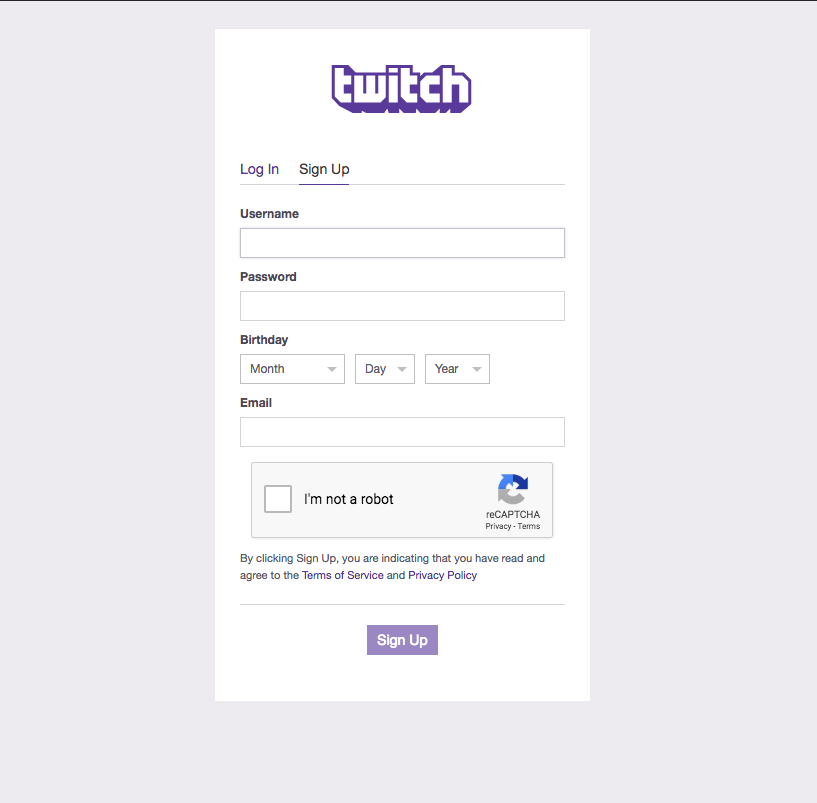

- In the top-right corner of the page, select `Sign up with Twitch`. If your screen is small, you might see a 'hamburger menu'. You should be able to click on that and get to the same place. 

 

- When the dialogue box appears, click on `Sign Up` and fill out a `Username`, `Password`, `Birthday`, email address (a confirmation email will be sent), and click `I am not a robot` and then click `Sign Up`. 

 

- A Twitch **Developer Access Page** will appear and click `Authorize`.

 

- You will again be returned to the main Developer page. You want to navigate to the Developer `Console`. 

 

- Navigate to `Application` and then click `Register Your Application`

 

- Fill in the `Name` of your application. We recommend something with yours initials as each application name needs to be unique.

- Fill in **OAuth Redirect URL** with `http://localhost`.

- The category is `Analytics Tool`

- Now click `Create`.

Once you've clicked `Create`, a page should appear with the `Client ID`. If this does not appear, go ahead and click on `Manage`.

Store the `Client ID`, you'll need this for the following activities.
